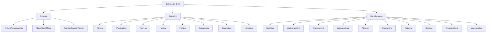

# Sistema de Skills - MMORPG

Sistema completo de habilidades para o MMORPG, dividido em três categorias principais: [[Combate]], [[Gathering]] e [[Manufacturing]].

## 🗺️ Visão Geral

## 🎯[[Sistema de Qualidade]]

Para todas as skills, utiliza-se um sistema de qualidade padronizado, relacionado com, quantidade na party, nível do desafio enfrentado, evento sendo participado e entre outras coisas. 

- **[[Qualidade - Comum]]** (branco) - básico
- **[[Qualidade - Incomum]]** (verde) - bônus simples
- **[[Qualidade - Raro]]** (azul) - bônus significativos
- **[[Qualidade - Épico]]** (roxo) - efeitos especiais
- **[[Qualidade - Lendário]]** (dourado) - únicos e poderosos

## ⚖️ Dicas de Balanceamento

1. **Progressão gradual:** Skills mais altas requerem materiais melhores
2. **Interdependência:** Manufacturing depende de Gathering
3. **Economia:** Skills raras criam items valiosos
4. **Personalização:** Jogadores podem focar em especializações

## 📚 Categorias Principais

- [[Combate]] - Skills de combate e classes
- [[Gathering]] - Skills de coleta de recursos
- [[Manufacturing]] - Skills de criação e manufatura

## 🔄 Integração entre Skills

As skills funcionam em conjunto para criar uma economia viva:
- [[Gathering]] fornece materiais para [[Manufacturing]]
- [[Manufacturing]] cria equipamentos para [[Combate]]
- [[Combate]] gera recursos para [[Gathering]]

---

*Esta é a documentação central do sistema de skills. Clique nos links para explorar cada categoria em detalhes.*

[[Skills]]

# Combate

Sistema de combate com três classes principais, cada uma com especializações únicas.

## ⚔️ Classes de Combate

### Archer / Arcane Archer
[[Archer]]

**Especialização:** Combate à distância com foco em precisão e magia elemental

**Mecânicas:**
- Carregar flechas mágicas (gelo, fogo, eletricidade)
- Precisão aumentada
- Chance de crítico em movimento
- Árvore de habilidades baseada em elementos ou efeitos de status

### Mage / Spirit Mage
[[Mage]]

**Especialização:** Magia pura com foco em controle e suporte

**Mecânicas:**
- Invocação de espíritos
- Canalização de mana
- Escudos mágicos, cura em área, buffs para grupo
- Árvore de habilidades com magia elemental e espiritual

### Warrior / Sacred Warrior
[[Warrior]]

**Especialização:** Combate corpo a corpo com foco em defesa e suporte

**Mecânicas:**
- Feitiços sagrados leves
- Proteções divinas
- Taunt (provoke), resistência a efeitos negativos, cura básica
- Árvore de habilidades com defesa e suporte corpo a corpo

## 🎯 Mecânicas Comuns

- Sistema de níveis e XP
- Habilidades passivas e ativas
- Combinação de skills para sinergias
- Progressão especializada

[[Sistema de Skills]]

# Gathering

Sistema de coleta de recursos com múltiplas skills especializadas.

## 🌾 Skills de Coleta Básicas

### Mining
[[Mining]]

**Coleta de:** Minérios variados
- Cobre, ferro, prata, ouro
- Mithril, adamantite, cristais mágicos
- Qualidades: Comum → Refinado → Encantado
- Ferramentas: Picareta básica → picareta mágica
- Eventos: Minas temporárias em eventos especiais

### Woodcutting
[[Woodcutting]]

**Coleta de:** Madeiras diversas
- Madeira comum, carvalho, ébano
- Madeira encantada, árvores dracônicas
- Árvores-fantasma (drops raros)
- Regeneração temporal de algumas árvores
- Ferramentas: Machado básico → machado elemental

### Farming
[[Farming]]

**Cultivo de:** Plantas e ervas
- Ervas medicinais, vegetais, frutas mágicas
- Sistema de estações
- Fertilizantes (craftados em manufacturing)
- Sistema de pragas e cuidados

### Hunting
[[Hunting]]

**Caça de:** Animais e monstros
- Animais comuns, feras mágicas
- Monstros lendários
- Drops: peles, chifres, glândulas, venenos
- Armadilhas (craftadas em manufacturing)
- Tracking: rastrear presas raras

## 🔍 Skills de Coleta Avançadas

### Fishing
[[Fishing]]

**Pesca em:** Diferentes ambientes
- Rios, oceanos, lagos mágicos
- Peixes raros: dragão, fantasmas
- Equipamentos: varas básicas → varas encantadas
- Eventos: peixes lendários em horários específicos

### Scavenging
[[Scavenging]]

**Vasculhar:** Diversos locais
- Corpos de monstros, destroços, esconderijos
- Drops: itens raros, componentes mágicos, moedas antigas
- Detecção: chance de tesouros escondidos

### Excavation
[[Excavation]]

**Escavação arqueológica**
- Sítios arqueológicos
- Artefatos antigos, relíquias
- Recompensas: itens históricos, conhecimento

### Herbalism
[[Herbalism]]

**Coleta de ervas especializada**
- Ervas medicinais, venenosas, mágicas
- Identificação de propriedades
- Sistema de colheita por hora certa

## ⚙️ Sistema de Progressão

- Níveis por skill
- Ferramentas melhoradas conforme nível
- Drops melhores com skills mais altas
- Áreas exclusivas para skills avançadas

[[Sistema de Skills]]

# Manufacturing

Sistema de criação e manufatura com múltiplas especializações.

## 🛠️ Skills de Manufatura Básicas

### Smithing
[[Smithing]]

**Criação de:** Itens metálicos
- **Especializações:**
  - Weapon Smithing (armas)
  - Armor Smithing (armaduras)
  - Tool Smithing (ferramentas)
- Qualidades: Comum → Mágico → Épico → Lendário
- Materiais: diferentes metais com propriedades únicas
- Blueprints: receitas raras de quests

### Leatherworking
[[Leatherworking]]

**Trabalho com:** Couros diversos
- Couro comum, couro de dragão, couro de fera mágica
- Produtos: armaduras leves, botas, luvas, bolsas
- Efeitos especiais: resistência a elementos, aumento de movimento
- Customização: cores e aparência personalizável

### Runemaking
[[Runemaking]]

**Criação de:** Runas mágicas
- Tipos: ataque, defesa, movimento, suporte
- Combinações para efeitos únicos
- Materiais: pedras rúnicas, pó mágico, essência elemental
- Aplicação: encantamentos ou consumíveis

### Woodworking
[[Woodworking]]

**Trabalho com:** Madeiras especiais
- Produtos: arcos, cajados mágicos, escudos, mobília
- Madeiras especiais: aumentam dano mágico, velocidade
- Customização: gravações, aparência única
- Especializações: Weapon Woodworking / Tool Woodworking

## 🎨 Skills de Manufatura Avançadas

### Alchemy
[[Alchemy]]

**Criação de:** Poções e compostos
- Poções: vida, mana, força, invisibilidade
- Ingredientes: ervas, essências, fluidos mágicos
- Efeitos combinados: poções com múltiplos efeitos
- Níveis: novato → mestre alquimista

### Enchanting
[[Enchanting]]

**Encantamento de:** Equipamentos
- Adicionar propriedades mágicas
- Requisitos: runas + essência mágica + item base
- Limites: número máximo de encantamentos
- Tipos: dano, defesa, utilidade

### Tailoring
[[Tailoring]]

**Alfaiataria:** Roupas e tecidos
- Produtos: roupas, mantos mágicos, bolsas
- Materiais: tecidos comuns, seda mágica, fibras elementais
- Efeitos: aumento de carisma, proteção mágica leve
- Customização: cores, estampas, bordados

### Cooking
[[Cooking]]

**Culinária:** Pratos e refeições
- Buffs temporários: +vida, +mana, +resistência
- Ingredientes: carne, vegetais, temperos raros
- Sistema de chef: títulos por pratos lendários
- Buffs acumulativos com combinações

### Armorsmithing
[[Armorsmithing]]

**Especialização em:** Armaduras
- Foco: armaduras pesadas, médias e leves
- Materiais avançados: placas dracônicas, malha etérea
- Defesas especiais: resistência a tipos específicos de dano

### Jewelcrafting
[[Jewelcrafting]]

**Criação de:** Joias e acessórios
- Produtos: anéis, amuletos, joias mágicas
- Pedras preciosas: cada tipo dá benefício diferente
- Combinações: joias sinérgicas
- Sockets: equipamentos com espaços para joias

## 📊 Sistema de Qualidade

Todas as skills seguem o padrão de qualidade:
- **Comum** (branco) - básico
- **Incomum** (verde) - bônus simples
- **Raro** (azul) - bônus significativos
- **Épico** (roxo) - efeitos especiais
- **Lendário** (dourado) - únicos e poderosos

## 🔗 Integração com Gathering

As skills de manufacturing dependem diretamente dos recursos coletados em [[Gathering]]:
- [[Mining]] → [[Smithing]] e [[Armorsmithing]]
- [[Woodcutting]] → [[Woodworking]]
- [[Farming]] e [[Herbalism]] → [[Alchemy]] e [[Cooking]]
- [[Hunting]] → [[Leatherworking]]
- [[Excavation]] → [[Jewelcrafting]]

[[Sistema de Skills]]

# Archer

Classe de combate à distância com especialização em precisão e magia elemental.

## 🎯 Mecânicas Principais

### Sistema de Flechas Mágicas
- **Flecha de Gelo:** Dano mágico + lentidão
- **Flecha de Fogo:** Dano contínuo
- **Flecha Elétrica:** Dano em cadeia
- **Flecha Sagrada:** Dano contra mortos-vivos
- **Flecha Venenosa:** Dano progressivo

### Habilidades de Precisão
- **Precisão Aumentada:** Bônus temporário de acerto
- **Tiro Crítico em Movimento:** Chance maior de crítico enquanto se move
- **Tiro Perfurante:** Atinge múltiplos alvos
- **Headshot:** Dano crítico massivo com penalidade de recarga

### Mobilidade
- **Salto Afastado:** Distância aumentada
- **Corrida Silenciosa:** Movimento sem ser detectado
- **Tiro em Movimento:** Precisão reduzida mas mobilidade total

## 🌟 Árvore de Habilidades

### Ramo Elemental
- **Mestre Elemental:** Dano mágico aumentado
- **Combinação Elemental:** Efeitos combinados (fogo+raio=explosão)
- **Imunidade Elemental:** Resistência ao elemento principal

### Ramo de Precisão
- **Olho de Falcão:** Aumento de alcance
- **Mira Perfeita:** Chance de acerto crítico aumentada
- **Tiro Rápido:** Múltiplos tiros em sequência

### Ramo de Suporte
- **Marcação de Alvo:** Marca inimigo para grupo
- **Flecha de Cura:** Cura aliados à distância
- **Barreira de Flechas:** Escudo protetor

## ⚒️ Equipamentos Especializados

### Arcos
- **Arcos Compostos:** Dano aumentado
- **Arcos Mágicos:** Propriedades elementais
- **Arcos Longos:** Maior alcance
- **Bestas:** Alta precisão e dano

### Flechas Especiais
- **Flechas Explosivas:** Dano em área
- **Flechas Teletransportadoras:** Teleporte curto
- **Flechas Iluminadoras:** Revela invisíveis

### Armaduras Leves
- **Trajes de Caçador:** Bônus de mobilidade
- **Armaduras de Couro Encantado:** Proteção mágica
- **Capas Camufladas:** Invisibilidade parcial

## 🔮 Sinergias com Outras Skills

### Com Gathering
- [[Hunting]]: Melhor identificação de pontos fracos
- [[Fishing]]: Paciência e precisão melhoradas

### Com Manufacturing
- [[Woodworking]]: Criação de arcos personalizados
- [[Fletching]] (especialização): Criação de flechas especiais
- [[Alchemy]]: Poções de precisão e visão

[[Combate]]

# Mage

Classe de combate mágico com foco em controle e suporte através de magia pura.

## 🔮 Mecânicas Principais

### Sistema de Magia Elemental
- **Magia de Fogo:** Dano direto e contínuo
- **Magia de Gelo:** Controle e lentidão
- **Magia Elétrica:** Dano em cadeia e paralisia
- **Magia de Terra:** Defesa e controle de área
- **Magia de Ar:** Mobilidade e buffs

### Sistema de Mana
- **Canalização:** Recuperação lenta mas constante de mana
- **Explosão Arcana:** Gasto massivo de mana para dano massivo
- **Conservação Mágica:** Redução de custo de magias
- **Poço de Mana:** Recuperação acelerada em área

### Controle de Multidões
- **Paralisia:** Imobilização temporária
- **Confusão:** Inimigos atacam aliados
- **Sono:** Inimigos dormem temporariamente
- **Transformação:** Mudança temporária de forma

## 🌟 Árvore de Habilidades

### Ramo de Fogo
- **Mestre Piromante:** Dano de fogo aumentado
- **Explosão Solar:** Dano massivo em área
- **Aura Ígnea:** Dano contínuo aos inimigos próximos

### Ramo de Gelo
- **Mestre Criomante:** Controles de gelo aprimorados
- **Tempestade de Nevasca:** Área de efeito massiva
- **Preservação Glacial:** Redução de dano recebido

### Ramo de Suporte
- **Toque da Vida:** Cura em toque
- **Barreira Arcana:** Escudo mágico
- **Encorajar:** Buffs para aliados

## ⚒️ Equipamentos Especializados

### Cajados e Varinhas
- **Cajados Elementais:** Dano aumentado do elemento correspondente
- **Varinhas Focais:** Redução de custo mágico
- **Orbes Cristalinos:** Aumento de área de efeito

### Roupas Mágicas
- **Vestes Arcanas:** Bônus de mana máxima
- **Mantos de Sábio:** Redução de custo de magias
- **Trajes de Batalha Mágica:** Proteção contra magias hostis

### Acessórios Mágicos
- **Anéis de Poder:** Aumento de dano mágico
- **Amuletos de Concentração:** Chance de magias críticas
- **Braceletes de Mana:** Recuperação acelerada

## 🌟 Magias Especiais

### Magias de Área
- **Meteoro:** Dano massivo em área pequena
- **Tornado:** Empurra inimigos e causa dano
- **Terremoto:** Dano e atordoamento em área grande

### Magias de Utilidade
- **Teleporte:** Movimento instantâneo
- **Invisibilidade:** Tornar-se invisível
- **Levitação:** Voar por curtos períodos

## 🔮 Sinergias com Outras Skills

### Com Gathering
- [[Herbalism]]: Ingredientes para [[Alchemy]]
- [[Excavation]]: Cristais mágicos para equipamentos

### Com Manufacturing
- [[Alchemy]]: Criação de poções mágicas
- [[Enchanting]]: Encantamentos em equipamentos
- [[Runemaking]]: Runas para magias especiais

[[Combate]]

# Warrior

Classe de combate corpo a corpo com foco em defesa e suporte através de força e proteção divina.

## ⚔️ Mecânicas Principais

### Sistema de Defesa
- **Bloqueio:** Redução de dano com escudo
- **Postura Defensiva:** Bônus de defesa e resistência
- **Reflexos de Combate:** Chance de esquivar ataques
- **Proteção Divina:** Redução de dano mágico

### Sistema de Aggro
- **Provocar:** Forçar inimigos a atacar
- **Presença Ameaçadora:** Aumento de aggro gerado
- **Desafio:** Marcar múltiplos inimigos
- **Escudo Refletor:** Refletir parte do dano

### Sistema de Combate Corpo a Cobra
- **Combos:** Sequências de golpes especiais
- **Golpes Especiais:** Habilidades de dano massivo
- **Desarmar:** Remover armas dos inimigos
- **Atordoar:** Paralisar inimigos temporariamente

## 🌟 Árvore de Habilidades

### Ramo de Defesa
- **Mestre Escudeiro:** Bônus de bloqueio e defesa
- **Muralha Intransponível:** Redução massiva de dano
- **Proteção em Área:** Proteger aliados próximos

### Ramo de Ataque
- **Berserker:** Dano aumentado com vida baixa
- **Golpe Devastador:** Dano massivo com recarga
- **Fúria de Batalha:** Aumento de velocidade de ataque

### Ramo de Suporte
- **Curandeiro de Batalha:** Cura básica em combate
- **Inspiração:** Buffs para aliados próximos
- **Sacrifício:** Transferir dano para si mesmo

## ⚒️ Equipamentos Especializados

### Armas
- **Espadas de Duas Mãos:** Alto dano individual
- **Martelos de Guerra:** Dano e atordoamento
- **Machados de Batalha:** Dano crítico aumentado
- **Lanças Longas:** Alcance aumentado

### Armaduras
- **Armaduras Pesadas:** Alta proteção física
- **Armaduras de Placas Sagradas:** Proteção divina
- **Trajes de Campeão:** Bônus de defesa e ataque

### Escudos
- **Escudos de Torre:** Alta proteção e bloqueio
- **Escudos Sagrados:** Propriedades mágicas de cura
- **Escudos Reforçados:** Refletem parte do dano

## 🛡️ Habilidades Especiais

### Habilidades Defensivas
- **Último Recurso:** Tornar-se imortal por curto tempo
- **Redemoinho Defensivo:** Defender todos os aliados próximos
- **Barreira de Ferro:** Escudo que protege contra tudo

### Habilidades de Controle
- **Grito de Guerra:** Aumentar stats de aliados
- **Intimidação:** Reduzir stats de inimigos
- **Comando de Batalha:** Coordenar aliados em combate

## 🔮 Sinergias com Outras Skills

### Com Gathering
- [[Mining]]: Força aumentada para mineração
- [[Hunting]]: Habilidades de rastreamento melhoradas

### Com Manufacturing
- [[Smithing]]: Criação de armas e armaduras melhores
- [[Armorsmithing]]: Especialização em proteção
- [[Cooking]]: Refeições que aumentam força e resistência

[[Combate]]

# Mining

Skill de coleta de minérios e materiais subterrâneos.

##  mining

### Tipos de Minérios
- **Cobre** - Nível 1: Material básico para ferramentas iniciais
- **Ferro** - Nível 10: Material comum para armas e armaduras
- **Prata** - Nível 20: Resistente a magias, usado em equipamentos mágicos
- **Ouro** - Nível 30: Valioso e usado em joias e equipamentos de elite
- **Mithril** - Nível 45: Leve e resistente, material de alta qualidade
- **Adamantite** - Nível 60: Extremamente resistente, para armaduras pesadas
- **Cristais Mágicos** - Nível 75: Fonte de poder arcano, usado em runas

### Qualidades de Minério
- **Comum** (branco) - Básico, sem bônus especiais
- **Refinado** (verde) - +10% eficiência em manufacturing
- **Encantado** (azul) - Propriedades mágicas, +20% eficiência
- **Divino** (roxo) - Propriedades únicas, +35% eficiência
- **Lendário** (dourado) - Extremamente raro, propriedades especiais

## ⚒️ Ferramentas de Mineração

### Picaretas
- **Picareta de Madeira** - Nível 1: Básica, chance baixa de encontrar raros
- **Picareta de Ferro** - Nível 15: Melhor duração, chance moderada
- **Picareta de Aço** - Nível 30: Dano aumentado ao minério, velocidade maior
- **Picareta Mágica** - Nível 45: Chance aumentada de minérios raros
- **Picareta de Mithril** - Nível 60: Chance de encontrar minérios divinos
- **Picareta Lendária** - Nível 75: Chance de encontrar minérios lendários

### Aperfeiçoamentos
- **Afiamento Mágico:** Aumenta chance de qualidade superior
- **Ampliação de Veio:** Aumenta quantidade coletada
- **Detecção de Riquezas:** Mostra minérios raros próximos

## 🏞️ Locais de Mineração

### Minas Comuns
- **Minas da Floresta** - Nível 1-25: Cobre, Ferro, Prata
- **Minas das Montanhas** - Nível 20-50: Prata, Ouro, Mithril
- **Minas Profundas** - Nível 40-70: Ouro, Mithril, Adamantite
- **Minas Elementais** - Nível 60-90: Adamantite, Cristais Mágicos

### Minas Especiais
- **Minas Temporárias:** Aparecem em eventos especiais
- **Minas Instáveis:** Alta recompensa, alto risco
- **Minas Abandonadas:** Requerem habilidades avançadas
- **Minas Dracônicas:** Fonte de minérios lendários

## 📊 Sistema de Progressão

### Níveis de Skill
- **Novato (1-15):** Apenas minérios comuns
- **Aprendiz (16-30):** Minérios comuns e refinados
- **Veterano (31-50):** Minérios refinados e encantados
- **Mestre (51-75):** Todos os tipos de minérios
- **Lendário (76+):** Chance de minérios únicos

### Recompensas Especiais
- **Veios Ricos:** Chance de encontrar minérios de qualidade superior
- **Depósitos Escondidos:** Minérios raros em locais secretos
- **Cristais de Poder:** Usados em encantamentos avançados

## 🔗 Sinergias com Outras Skills

### Com Manufacturing
- [[Smithing]]: Processamento de minérios em equipamentos
- [[Runemaking]]: Cristais mágicos para criação de runas
- [[Jewelcrafting]]: Ouro e prata para criação de joias

### Com Gathering
- [[Excavation]]: Complementa a busca por materiais subterrâneos
- [[Scavenging]]: Encontrar ferramentas e equipamentos em minas

[[Gathering]]

# Woodcutting

Skill de coleta de madeira e materiais florestais.

## 🌳 Tipos de Madeira

### Madeiras Comuns
- **Madeira Comum** - Nível 1: Básica para ferramentas iniciais
- **Carvalho** - Nível 15: Resistente, usado em construção e armas básicas
- **Pinho** - Nível 10: Leve, ideal para iniciais

### Madeiras Especiais
- **Ébano** - Nível 25: Escura e densa, excelente para armas
- **Teixo** - Nível 35: Flexível e forte, ideal para arcos
- **Cedro** - Nível 30: Aromática, usada em mobília mágica

### Madeiras Mágicas
- **Madeira Encantada** - Nível 45: Conduz magia, usada em cajados
- **Madeira Dracônica** - Nível 60: Resistente ao fogo, extremamente valiosa
- **Madeira-Fantasma** - Nível 70: Eterna, usada em itens lendários
- **Madeira da Vida** - Nível 80: Regenerativa, propriedades únicas

## 🪓 Ferramentas de Corte

### Machados
- **Machado de Madeira** - Nível 1: Básico, eficiente em árvores jovens
- **Machado de Ferro** - Nível 15: Melhor durabilidade, corte mais rápido
- **Machado de Aço** - Nível 30: Dano aumentado, chance de madeira melhor
- **Machado Mágico** - Nível 45: Chance aumentada de madeiras raras
- **Machado de Mithril** - Nível 60: Chance de madeiras dracônicas
- **Machado Lendário** - Nível 75: Chance de madeiras fantasma

### Aperfeiçoamentos
- **Lâmina Afiada:** Aumenta velocidade de corte
- **Extensão Mágica:** Alcance aumentado
- **Detecção Arbórea:** Mostra árvores raras próximas

## 🌲 Árvores Especiais

### Árvores Comuns
- **Árvores Jovens:** Madeira comum, rápido crescimento
- **Árvores Adultas:** Madeira melhor, tempo de crescimento médio

### Árvores Raras
- **Árvores Anciãs:** Madeira de alta qualidade, crescimento lento
- **Árvores Dracônicas:** Fonte de madeira dracônica
- **Árvores-Fantasma:** Eternas, extremamente raras

### Árvores Evento
- **Árvores Sagradas:** Aparecem em eventos, madeira bendita
- **Árvores Corrompidas:** Madeira sombria, propriedades únicas
- **Árvores Elementais:** Madeira com afinidade elemental

## 📊 Sistema de Progressão

### Níveis de Skill
- **Novato (1-20):** Apenas madeiras comuns
- **Aprendiz (21-40):** Madeiras comuns e especiais
- **Veterano (41-60):** Madeiras especiais e mágicas básicas
- **Mestre (61-80):** Todas as madeiras exceto lendárias
- **Lendário (81+):** Chance de madeiras lendárias

### Mecânicas Especiais
- **Tempo de Crescimento:** Árvores regeneram com o tempo
- **Estações:** Diferentes árvores aparecem em estações diferentes
- **Ciclo Lunar:** Efeitos na qualidade da madeira colhida

## 🌿 Drops Especiais

### Recursos Adicionais
- **Sap** - Usado em [[Alchemy]] e [[Enchanting]]
- **Frutos** - Comestíveis ou ingredientes
- **Casca Mágica** - Componente para poções
- **Folhas Especiais** - Usadas em [[Tailoring]]

## 🔗 Sinergias com Outras Skills

### Com Manufacturing
- [[Woodworking]]: Processamento principal da madeira coletada
- [[Fletching]] (especialização): Criação de flechas e arcos
- [[Alchemy]]: Ingredientes naturais para poções

### Com Gathering
- [[Herbalism]]: Coleta complementar em áreas florestais
- [[Farming]]: Áreas de cultivo próximas a zonas florestais
- [[Hunting]]: Animais que vivem em florestas densas

[[Gathering]]

# Farming

Skill de cultivo e agricultura para produção de alimentos e ingredientes mágicos.

## 🌱 Tipos de Cultivo

### Vegetais Comuns
- **Cenouras** - Nível 1: Básico, rápido crescimento
- **Batatas** - Nível 5: Nutritivas, armazenamento longo
- **Trigo** - Nível 10: Base para pães e alimentos básicos

### Ervas Medicinais
- **Camomila** - Nível 15: Calmante, usado em [[Cooking]]
- **Ginseng** - Nível 25: Energizante, ingrediente em [[Alchemy]]
- **Valeriana** - Nível 35: Sedativo potente, rara

### Frutas Mágicas
- **Maçã Dourada** - Nível 20: Pequeno buff de vida
- **Uvas da Sabedoria** - Nível 40: Aumento temporário de inteligência
- **Fruta da Longevidade** - Nível 60: Redução de envelhecimento

### Plantas Raras
- **Erva dos Sonhos** - Nível 50: Ingrediente para poções do sono
- **Flor de Fogo** - Nível 55: Resistência ao fogo temporária
- **Raiz de Estrela** - Nível 70: Componente para itens lendários

## 🌾 Sistema de Estações

### Primavera
- **Plantas Disponíveis:** Trigo, cenouras, camomila
- **Bônus:** Crescimento 20% mais rápido
- **Especial:** Flores raras aparecem

### Verão
- **Plantas Disponíveis:** Batatas, ginseng, maçã dourada
- **Bônus:** Qualidade aumentada
- **Risco:** Pragas mais comuns

### Outono
- **Plantas Disponíveis:** Trigo, uvas da sabedoria, frutos secos
- **Bônus:** Quantidade aumentada
- **Especial:** Plantas colhidas duram mais

### Inverno
- **Plantas Disponíveis:** Plantas resistentes ao frio
- **Bônus:** Propriedades mágicas intensificadas
- **Limitação:** Maioria das plantas não cresce

## 🌿 Fertilizantes e Aprimoramentos

### Fertilizantes Básicos
- **Adubo Orgânico** - Nível 1: Crescimento +10%
- **Fertilizante Composto** - Nível 20: Crescimento +25%, qualidade +15%
- **Fertilizante Mágico** - Nível 40: Crescimento +40%, chance de plantas raras

### Fertilizantes Especiais
- **Adubo de Dragão** - Nível 60: Chance de plantas lendárias
- **Nutrientes Estelares** - Nível 75: Crescimento noturno acelerado

### Sistema de Cuidado
- **Rega:** Necessário para crescimento adequado
- **Proteção:** Defesa contra pragas e animais
- **Podas:** Aumenta qualidade final

## 🐛 Sistema de Pragas e Doenças

### Pragas Comuns
- **Lagartas:** Dano às folhas
- **Besouros:** Dano às raízes
- **Ácaros:** Transmitem doenças

### Doenças Vegetais
- **Ferrugem:** Reduz crescimento
- **Míldio:** Pode matar a planta
- **Podridão:** Contamina plantas próximas

### Soluções
- **Pesticidas:** [[Alchemy]] - Spray repelente
- **Predadores Naturais:** [[Hunting]] - Insetos benéficos
- **Rotação de Culturas:** Prevenção natural

## 📊 Sistema de Progressão

### Níveis de Skill
- **Novato (1-20):** Plantas comuns e básicas
- **Aprendiz (21-40):** Ervas medicinais e frutas mágicas básicas
- **Veterano (41-60):** Plantas raras e especiais
- **Mestre (61-80):** Todas as plantas exceto lendárias
- **Lendário (81+):** Chance de plantas lendárias

### Recompensas Especiais
- **Colheitas Abundantes:** Chance de obter mais do que o normal
- **Plantas Perfeitas:** Qualidade máxima garantida
- **Sementes Mágicas:** Plantas com propriedades únicas

## 🔗 Sinergias com Outras Skills

### Com Manufacturing
- [[Cooking]]: Processamento de vegetais em alimentos
- [[Alchemy]]: Transformação de ervas em poções
- [[Herbalism]]: Coleta complementar de plantas selvagens

### Com Gathering
- [[Woodcutting]]: Áreas de cultivo próximas a zonas florestais
- [[Fishing]]: Fertilizantes feitos com restos de peixe
- [[Scavenging]]: Encontrar sementes raras

[[Gathering]]

# Hunting

Skill de caça e rastreamento de animais e monstros para obtenção de recursos.

## 🦌 Tipos de Presas

### Animais Comuns
- **Coelhos** - Nível 1: Pele leve, carne básica
- **Esquilos** - Nível 5: Pele macia, nozes
- **Veados** - Nível 10: Carne nutritiva, couro médio, chifres

### Feras Médias
- **Lobos** - Nível 20: Pele grossa, dentes afiados
- **Ursos** - Nível 25: Carne forte, pele pesada, garras
- **Javalis** - Nível 15: Carne saborosa, presas

### Feras Mágicas
- **Lobos Espectrais** - Nível 40: Pele etérea, dentes mágicos
- **Ursos de Gelo** - Nível 45: Pele térmica, garras congelantes
- **Panteras Sombrias** - Nível 50: Pele invisível, garras afiadas

### Monstros Lendários
- **Dragão Jovem** - Nível 70: Escamas, fogo, garras dracônicas
- **Fênix** - Nível 80: Penas regenerativas, essência de fogo
- **Unicórnio** - Nível 75: Chifre mágico, crina sagrada

## 🎯 Sistema de Rastreamento

### Habilidades de Tracking
- **Rastrear Pegadas** - Nível 1: Seguir trilhas visíveis
- **Detecção de Odores** - Nível 20: Sentir presenças próximas
- **Visão Térmica** - Nível 40: Ver através de obstáculos
- **Sentido Mágico** - Nível 60: Detectar criaturas mágicas

### Marcadores de Rastreamento
- **Marcas Territoriais:** Identificar áreas de caça
- **Ninhos e Tocas:** Localizar criaturas em repouso
- **Trilhas de Alimentação:** Prever movimentos das presas

## 🪤 Armadilhas e Equipamentos

### Armadilhas Básicas
- **Laço Simples** - Nível 1: Captura presas pequenas
- **Armadilha de Urso** - Nível 25: Imobiliza feras médias
- **Gaiola Mágica** - Nível 50: Contém criaturas mágicas

### Armadilhas Avançadas
- **Rede de Caça Encantada** - Nível 40: Não danifica a presa
- **Armadilha de Tempo** - Nível 60: Ativa em momento específico
- **Prisão Dimensional** - Nível 75: Contém criaturas lendárias

### Equipamentos Especiais
- **Chifres de Comando:** Controlar animais domesticados
- **Óculos de Predador:** Visão aumentada para caça
- **Botas Silenciosas:** Aproximação sem ser detectado

## 📊 Sistema de Progressão

### Níveis de Skill
- **Novato (1-20):** Animais comuns e fáceis
- **Aprendiz (21-40):** Feras médias e algumas mágicas
- **Veterano (41-60):** Feras mágicas e criaturas poderosas
- **Mestre (61-80):** Monstros lendários e criaturas raras
- **Lendário (81+):** Criaturas únicas e eventos especiais

### Recompensas Especiais
- **Trophies:** Itens colecionáveis de caçadas bem-sucedidas
- **Pele Perfeita:** Sem cortes ou danos
- **Drop Raro:** Componentes exclusivos de criaturas especiais

## 🧪 Drops Especializados

### Materiais Comuns
- **Peles e Couros:** [[Leatherworking]]
- **Carnes:** [[Cooking]]
- **Dentes e Garras:** Adornos e armas

### Materiais Mágicos
- **Essências Vitais:** [[Alchemy]] e [[Enchanting]]
- **Glândulas:** Poções e venenos
- **Chifres e Escamas:** Componentes mágicos

### Componentes Raros
- **Corações Ardentes:** Fonte de poder elemental
- **Almas Condensadas:** Para itens lendários
- **Fragmentos de Núcleo:** Energia pura

## 🔗 Sinergias com Outras Skills

### Com Manufacturing
- [[Leatherworking]]: Processamento de peles em armaduras
- [[Cooking]]: Transformação de carnes em alimentos
- [[Alchemy]]: Extração de essências e criação de venenos

### Com Gathering
- [[Scavenging]]: Complementa a busca por recursos em carcaças
- [[Farming]]: Proteção de cultivos contra pragas
- [[Woodcutting]]: Caça em áreas florestais

[[Gathering]]

# Fishing

Skill de pesca em diferentes ambientes aquáticos para obtenção de alimentos e recursos raros.

## 🎣 Tipos de Pesca

### Ambientes de Pesca
- **Rios** - Nível 1: Peixes comuns e básicos
- **Lagos** - Nível 10: Peixes médios e algumas variedades
- **Oceanos** - Nível 25: Peixes grandes e exóticos
- **Lagos Mágicos** - Nível 50: Peixes com propriedades mágicas
- **Aguas Abissais** - Nível 70: Criaturas profundas e lendárias

### Técnicas de Pesca
- **Pesca com Rede** - Nível 1: Captura múltipla, peixes pequenos
- **Pesca com Linha** - Nível 5: Precisão, peixes médios
- **Pesca com Arpão** - Nível 30: Peixes grandes e agressivos
- **Pesca Mágica** - Nível 55: Atrai peixes raros automaticamente

## 🐟 Tipos de Peixes

### Peixes Comuns
- **Salmão** - Nível 1: Nutritivo, usado em [[Cooking]]
- **Truta** - Nível 5: Sabor refinado, carne branca
- **Carpa** - Nível 3: Resistente, fácil captura

### Peixes Especiais
- **Peixe-Espada** - Nível 25: Carne premium, espinha valiosa
- **Atum** - Nível 30: Grande, carne vermelha de qualidade
- **Enguia Elétrica** - Nível 40: Propriedades elétricas, rara

### Peixes Mágicos
- **Peixe-Dragão** - Nível 55: Escamas mágicas, fogo interno
- **Peixe-Fantasma** - Nível 60: Translúcido, invisibilidade temporária
- **Peixe da Sabedoria** - Nível 65: Aumenta inteligência quando consumido

### Peixes Lendários
- **Kraken Jovem** - Nível 80: Tentáculos, poder aquático
- **Peixe-Deus** - Nível 90: Concede bênçãos temporárias
- **Leviatã** - Nível 95: Criatura mítica, extremamente rara

## 🎣 Equipamentos de Pesca

### Varas de Pesca
- **Vara de Madeira** - Nível 1: Básica, para iniciantes
- **Vara de Ferro** - Nível 15: Mais resistente, melhor controle
- **Vara de Mithril** - Nível 45: Sensibilidade aumentada
- **Vara Encantada** - Nível 60: Atrai peixes raros
- **Vara Lendária** - Nível 80: Chance de capturar peixes lendários

### Acessórios
- **Anzóis Mágicos:** Aumentam chance de captura
- **Chumbadas Especiais:** Permitem pescar em profundidades diferentes
- **Isca Brilhante:** Atrai peixes em área maior

## 🌊 Eventos de Pesca

### Eventos Temporais
- **Maré Cheia:** Peixes raros aparecem
- **Lua Cheia:** Peixes mágicos mais ativos
- **Tempestade:** Peixes agressivos e valiosos
- **Equinócio:** Chance de peixes lendários

### Locais Especiais
- **Poço dos Desejos:** Peixes com propriedades místicas
- **Riacho Encantado:** Peixes curadores
- **Mar Morto Mágico:** Criaturas únicas e perigosas

## 📊 Sistema de Progressão

### Níveis de Skill
- **Novato (1-20):** Peixes comuns em ambientes básicos
- **Aprendiz (21-40):** Peixes especiais em lagos e oceanos
- **Veterano (41-60):** Peixes mágicos em águas místicas
- **Mestre (61-80):** Peixes lendários em águas profundas
- **Lendário (81+):** Criaturas míticas e eventos especiais

### Recompensas Especiais
- **Pescaria Abundante:** Chance de múltiplos peixes por captura
- **Peixe Perfeito:** Qualidade máxima garantida
- **Tesouro Submerso:** Itens raros além dos peixes

## 🧪 Utilidades dos Peixes

### Alimentação
- **Peixes Comuns:** [[Cooking]] - Pratos básicos
- **Peixes Especiais:** [[Cooking]] - Pratos gourmet
- **Peixes Mágicos:** [[Cooking]] - Pratos com buffs temporários

### Componentes
- **Escamas:** [[Tailoring]] e [[Enchanting]]
- **Dentes e Ossos:** [[Smithing]] e [[Jewelcrafting]]
- **Essência Aquática:** [[Alchemy]] - Poções de respiração

## 🔗 Sinergias com Outras Skills

### Com Manufacturing
- [[Cooking]]: Transformação de peixes em pratos deliciosos
- [[Alchemy]]: Extração de essências aquáticas
- [[Enchanting]]: Escamas para encantamentos de água

### Com Gathering
- [[Scavenging]]: Complementa a busca por tesouros submersos
- [[Farming]]: Aquaponia - combinação de pesca e agricultura
- [[Hunting]]: Criaturas aquáticas como presas alternativas

[[Gathering]]

# Scavenging

Skill de vasculhar e saquear locais e objetos para encontrar recursos valiosos e itens raros.

## 🔍 Locais de Vasculhamento

### Corpos e Carcaças
- **Corpos de Monstros** - Nível 1: Drops básicos e comuns
- **Cadáveres de Aventureiros** - Nível 20: Equipamentos e suprimentos
- **Restos de Criaturas Mágicas** - Nível 50: Componentes mágicos
- **Esqueletos Antigos** - Nível 65: Artefatos históricos

### Destroços e Esconderijos
- **Destroços de Navios** - Nível 15: Tesouros submersos
- **Ruínas Abandonadas** - Nível 30: Itens antigos e misteriosos
- **Tocas de Bandidos** - Nível 25: Saques escondidos
- **Covis de Monstros** - Nível 40: Tesouros acumulados

### Áreas Especiais
- **Campos de Batalha** - Nível 10: Equipamentos perdidos
- **Mercados Abandonados** - Nível 35: Mercadorias esquecidas
- **Laboratórios Mágicos** - Nível 55: Componentes alquímicos
- **Túmulos Antigos** - Nível 70: Relíquias e maldições

## 🎯 Mecânicas de Vasculhamento

### Sistema de Detecção
- **Visão Aguçada** - Nível 1: Notar itens fora do comum
- **Sentido do Saque** - Nível 25: Detectar tesouros escondidos
- **Visão Mágica** - Nível 50: Ver itens encantados e amaldiçoados
- **Instinto de Aventureiro** - Nível 75: Encontrar itens lendários

### Técnicas de Busca
- **Vasculhar Superficial** - Rápido, chance menor
- **Busca Minuciosa** - Lento, chance maior
- **Escaneamento Mágico** - Requer mana, detecta itens mágicos
- **Análise Forense** - Avançado, informações detalhadas

## 🧰 Equipamentos Especializados

### Ferramentas de Vasculho
- **Lupa Básica** - Nível 1: Aumenta chance de encontrar detalhes
- **Kit de Exploração** - Nível 20: Múltiplas funções de busca
- **Detector Mágico** - Nível 45: Encontra itens encantados
- **Scanner Dimensional** - Nível 70: Detecta itens em planos alternativos

### Equipamentos de Proteção
- **Luvas de Coleta** - Protege contra armadilhas
- **Óculos de Detecção** - Aumenta alcance de visão
- **Mochila Dimensional** - Espaço extra para itens encontrados

## 📊 Sistema de Progressão

### Níveis de Skill
- **Novato (1-20):** Itens comuns e básicos
- **Aprendiz (21-40):** Itens incomuns e alguns raros
- **Veterano (41-60):** Itens raros e alguns épicos
- **Mestre (61-80):** Itens épicos e lendários
- **Lendário (81+):** Itens únicos e artefatos

### Recompensas Especiais
- **Farol de Saque:** Chance aumentada de drops raros
- **Toque Dourado:** Itens encontrados têm qualidade superior
- **Sorte do Aventureiro:** Encontrar itens além do nível normal

## 🎁 Tipos de Drops

### Recursos Básicos
- **Moedas Antigas:** Dinheiro esquecido
- **Materiais Comuns:** Ferro, madeira, tecido
- **Componentes Simples:** Ervas, pedras, ossos

### Recursos Valiosos
- **Joias Perdidas:** [[Jewelcrafting]] - Gemas raras
- **Equipamentos Esquecidos:** Armas e armaduras antigas
- **Livros Antigos:** Conhecimento perdido

### Recursos Mágicos
- **Essências Condensadas:** [[Alchemy]] e [[Enchanting]]
- **Runas Quebradas:** [[Runemaking]] - Reparáveis
- **Cristais de Poder:** Fonte de energia mágica

### Recursos Lendários
- **Artefatos Antigos:** Poder imenso e misterioso
- **Relíquias Sagradas:** Bênçãos divinas
- **Fragmentos de Deuses:** Poder cósmico

## 🔗 Sinergias com Outras Skills

### Com Manufacturing
- [[Alchemy]]: Componentes raros para poções
- [[Enchanting]]: Itens para encantar e cristais de poder
- [[Jewelcrafting]]: Joias perdidas para restauração

### Com Gathering
- [[Mining]]: Encontrar veios escondidos
- [[Woodcutting]]: Descobrir árvores raras derrubadas
- [[Hunting]]: Complementar a coleta de drops de caça

### Com Combate
- [[Warrior]]: Encontrar equipamentos de guerreiros caídos
- [[Mage]]: Descobrir grimórios e varinhas perdidas
- [[Archer]]: Localizar arcos e flechas especiais

[[Gathering]]

# Excavation

Skill de escavação arqueológica para descobrir artefatos, relíquias e conhecimentos perdidos.

## 🏺 Locais de Escavação

### Sítios Arqueológicos
- **Ruínas Antigas** - Nível 1: Artefatos de civilizações perdidas
- **Túmulos Reais** - Nível 30: Tesouros de reis e rainhas
- **Templos Abandonados** - Nível 45: Relíquias religiosas
- **Cidades Submersas** - Nível 60: Tecnologia antiga e mágica

### Áreas Especiais
- **Campos de Batalha Antigos** - Nível 20: Armas e armaduras de guerra
- **Laboratórios Alquímicos** - Nível 50: Fórmulas e equipamentos perdidos
- **Bibliotecas Proibidas** - Nível 65: Conhecimento arcano
- **Portais Antigos** - Nível 75: Artefatos dimensionais

### Locais Perigosos
- **Covis de Cultistas** - Nível 40: Itens amaldiçoados e proibidos
- **Cemitérios Esquecidos** - Nível 35: Relíquias de almas perdidas
- **Minas Abandonadas** - Nível 25: Tesouros minerados e esquecidos

## 🛠️ Técnicas de Escavação

### Métodos Básicos
- **Escavação Manual** - Nível 1: Cuidadoso, preserva integridade
- **Peneiramento** - Nível 15: Encontra itens pequenos e fragmentos
- **Escovação Precisa** - Nível 30: Para artefatos delicados

### Métodos Avançados
- **Escaneamento Mágico** - Nível 50: Detecta itens encantados
- **Carbono Datador** - Nível 55: Determina idade dos artefatos
- **Reconstrução 3D** - Nível 70: Visualiza artefatos antes da escavação

### Preservação
- **Conselvação Química** - Mantém integridade dos artefatos
- **Campo de Proteção Mágico** - Previne deterioração
- **Câmara de Estabilização** - Para itens instáveis

## 🧰 Equipamentos de Excavação

### Ferramentas Básicas
- **Pá Arqueológica** - Nível 1: Design especial para escavação
- **Pincel de Precisão** - Nível 15: Limpeza delicada de artefatos
- **Kit de Preservação** - Nível 25: Mantém itens em bom estado

### Equipamentos Avançados
- **Detector de Relíquias** - Nível 40: Localiza artefatos enterrados
- **Scanner Geológico** - Nível 55: Mapeia estruturas subterrâneas
- **Laboratório Portátil** - Nível 70: Análise imediata de descobertas

### Equipamentos de Proteção
- **Traje de Excavador** - Proteção contra poeira e detritos
- **Óculos de Ampliação** - Detalhes precisos em artefatos
- **Luvas Anti-estática** - Previnir danos a itens mágicos

## 📊 Sistema de Progressão

### Níveis de Skill
- **Novato (1-20):** Artefatos comuns e fragmentos
- **Aprendiz (21-40):** Relíquias históricas e itens incomuns
- **Veterano (41-60):** Artefatos mágicos e itens raros
- **Mestre (61-80):** Relíquias divinas e itens épicos
- **Lendário (81+):** Artefatos lendários e conhecimento perdido

### Especializações
- **Arqueólogo Militar:** Foco em armas e armaduras antigas
- **Arqueólogo Mágico:** Especialista em itens arcanos
- **Arqueólogo Histórico:** Conhecimento e documentos antigos

## 🎁 Recompensas Arqueológicas

### Artefatos Históricos
- **Moedas Antigas:** [[Economia]] - Valores históricos
- **Joias de Nobres:** [[Jewelcrafting]] - Designs únicos
- **Instrumentos Musicais:** Propriedades culturais

### Relíquias Mágicas
- **Amuletos Sagrados:** [[Enchanting]] - Bênçãos divinas
- **Cajados Antigos:** [[Mage]] - Poder arcano concentrado
- **Escudos Heróicos:** [[Warrior]] - Proteção lendária

### Conhecimento Perdido
- **Livros de Feitiços:** Novas magias para [[Mage]]
- **Técnicas de Combate:** Habilidades para [[Warrior]] e [[Archer]]
- **Fórmulas Alquímicas:** Receitas para [[Alchemy]]

### Componentes Raros
- **Metais Antigos:** [[Smithing]] - Materiais superiores
- **Cristais Pré-históricos:** [[Runemaking]] - Poder primordial
- **Essências Petrificadas:** [[Enchanting]] - Energia condensada

## 🔍 Eventos Arqueológicos

### Descobertas Especiais
- **Sítio Virgem:** Chance de descobrir civilização perdida
- **Câmara Selada:** Tesouro protegido por magia antiga
- **Túmulo Real:** Riquezas de governantes antigos

### Desafios
- **Quebra-Cabeças Antigos:** Resolver para acessar tesouros
- **Armadilhas Históricas:** Desarmar para segurança
- **Guardiões Mágicos:** Derrotar para obter relíquias

## 🔗 Sinergias com Outras Skills

### Com Manufacturing
- [[Smithing]]: Restauração de armas e armaduras antigas
- [[Enchanting]]: Reativação de itens mágicos perdidos
- [[Jewelcrafting]]: Replicação de designs antigos

### Com Gathering
- [[Mining]]: Complementa escavação em minas antigas
- [[Scavenging]]: Encontrar ferramentas e equipamentos de arqueólogos
- [[Herbalism]]: Descobrir plantas medicinais usadas por civilizações antigas

### Com Combate
- [[Warrior]]: Treinamento com técnicas de combate antigas
- [[Mage]]: Aprendizado de magias esquecidas
- [[Archer]]: Descobrir estilos de arco antigos

[[Gathering]]

# Herbalism

Skill especializada na coleta, identificação e utilização de ervas medicinais e mágicas.

## 🌿 Tipos de Ervas

### Ervas Medicinais Comuns
- **Camomila** - Nível 1: Calmante, usado em [[Cooking]] e [[Alchemy]]
- **Hortelã** - Nível 5: Digestivo, refrescante
- **Erva-Cidreira** - Nível 10: Relaxante, aroma agradável
- **Sábila** - Nível 8: Cicatrizante, suco refrescante

### Ervas Medicinais Avançadas
- **Ginseng** - Nível 25: Energizante, aumenta resistência
- **Valeriana** - Nível 35: Sedativo potente, sono profundo
- **Echinacea** - Nível 30: Fortalece sistema imunológico
- **Ginkgo Biloba** - Nível 40: Melhora memória e concentração

### Ervas Mágicas
- **Erva dos Sonhos** - Nível 50: Induz sonhos vívidos, comunicação espiritual
- **Flor de Fogo** - Nível 55: Resistência ao fogo temporária
- **Raiz de Estrela** - Nível 70: Componente para itens lendários
- **Orvalho da Manhã** - Nível 45: Purifica venenos e toxinas

### Ervas Raras e Lendárias
- **Sangue de Dragão** - Nível 80: Regeneração acelerada
- **Lágrima de Fênix** - Nível 85: Ressurreição parcial
- **Beijo de Unicórnio** - Nível 90: Purificação mágica total
- **Respiração de Titã** - Nível 95: Força sobre-humana temporária

## 🌱 Sistemas Especiais

### Horário de Colheita
- **Manhã Cedo:** Orvalho da Manhã, ervas frescas
- **Meio-dia:** Ervas com propriedades solares
- **Anoitecer:** Ervas noturnas e lunares
- **Meia-noite:** Ervas sombrias e místicas

### Condições Climáticas
- **Sol Pleno:** Ervas solares potencializadas
- **Chuva:** Ervas aquáticas e purificadoras
- **Neblina:** Ervas místicas e espirituais
- **Tempestade:** Ervas elétricas e poderosas

### Ciclos Lunares
- **Lua Nova:** Ervas de renovação e começo
- **Lua Crescente:** Ervas de crescimento e energia
- **Lua Cheia:** Ervas mágicas potencializadas
- **Lua Minguante:** Ervas de purificação e fim

## 🧰 Equipamentos de Herbalismo

### Ferramentas Básicas
- **Faca de Coleta** - Nível 1: Corte preciso sem danificar a planta
- **Cesta de Coleta** - Nível 5: Preserva frescor das ervas
- **Livro de Identificação** - Nível 15: Reconhece propriedades das ervas

### Ferramentas Avançadas
- **Lupa Botânica** - Nível 25: Detalhes microscópicos das ervas
- **Kit de Preservação** - Nível 40: Mantém propriedades mágicas
- **Detector Mágico** - Nível 60: Identifica ervas encantadas

### Equipamentos Especializados
- **Luvas de Toque Verde** - Comunicação com plantas
- **Óculos de Visão Botânica** - Veem saúde das plantas
- **Mochila Climática** - Ambiente controlado para ervas raras

## 📊 Sistema de Progressão

### Níveis de Skill
- **Novato (1-20):** Ervas comuns e básicas
- **Aprendiz (21-40):** Ervas medicinais e algumas mágicas
- **Veterano (41-60):** Ervas mágicas e raras
- **Mestre (61-80):** Ervas lendárias e componentes épicos
- **Lendário (81+):** Ervas míticas e conhecimento botânico divino

### Especializações
- **Herbalista Médico:** Foco em curas e tratamentos
- **Herbalista Mágico:** Especialista em componentes arcanos
- **Herbalista Alquímico:** Mestre em ingredientes para poções

## 🧪 Propriedades e Utilidades

### Propriedades Medicinais
- **Curativas:** Regeneração de vida e cura de doenças
- **Fortalecedoras:** Aumento temporário de stats
- **Protetoras:** Resistência a venenos e maldições
- **Estimulantes:** Energia e clareza mental

### Propriedades Mágicas
- **Elementais:** Afinidade com fogo, gelo, raio, terra
- **Espirituais:** Comunicação com espíritos e mortos
- **Temporais:** Manipulação do tempo local
- **Dimensionais:** Portais e teletransporte

### Transformações
- **Chás e Infusões:** [[Cooking]] - Bebidas terapêuticas
- **Essências Concentradas:** [[Alchemy]] - Poções potentes
- **Incensos:** Efeitos em área e rituais
- **Unguentos:** Aplicações tópicas e tratamentos

## 🔗 Sinergias com Outras Skills

### Com Manufacturing
- [[Alchemy]]: Transformação de ervas em poções e elixires
- [[Cooking]]: Criação de pratos e chás medicinais
- [[Enchanting]]: Essências herbais para encantamentos

### Com Gathering
- [[Farming]]: Cultivo de ervas raras e mágicas
- [[Woodcutting]]: Coleta de ervas em florestas densas
- [[Scavenging]]: Encontrar sementes e raízes raras

### Com Combate
- [[Mage]]: Componentes para magias naturais
- [[Warrior]]: Poções de força e resistência
- [[Archer]]: Unguentos para precisão e visão

[[Gathering]]

# Smithing

Skill de manufatura especializada na criação de itens metálicos através da forja e trabalho com metais.

## ⚒️ Especializações

### Weapon Smithing
[[Weapon Smithing]]

**Foco:** Criação de armas de combate
- Espadas, machados, lanças, martelos
- Arcos e bestas (com componentes metálicos)
- Armas mágicas e encantadas

### Armor Smithing
[[Armor Smithing]]

**Foco:** Criação de armaduras protetoras
- Armaduras leves, médias e pesadas
- Escudos e proteções especializadas
- Armaduras mágicas e encantadas

### Tool Smithing
[[Tool Smithing]]

**Foco:** Criação de ferramentas utilitárias
- Ferramentas de gathering aprimoradas
- Instrumentos especializados
- Equipamentos técnicos

## 🏗️ Processo de Forja

### Etapas Básicas
1. **Seleção do Metal:** Escolha do material base
2. **Aquecimento:** Preparação do metal na forja
3. **Martelamento:** Moldagem da forma desejada
4. **Tempera:** Tratamento térmico para resistência
5. **Acabamento:** Polimento e detalhes finais

### Qualidade do Processo
- **Trabalho Rápido:** Tempo reduzido, qualidade menor
- **Trabalho Preciso:** Tempo normal, qualidade média
- **Trabalho Mestre:** Tempo longo, qualidade superior

## 🗨️ Materiais e Metais

### Metais Comuns
- **Ferro** - Nível 1: Básico, durável
- **Aço** - Nível 20: Mais resistente, afiado
- **Prata** - Nível 30: Resistente a magias, anti-maldição

### Metais Especiais
- **Mithril** - Nível 45: Leve e extremamente resistente
- **Adamantite** - Nível 60: Pesado, proteção máxima
- **Titanium** - Nível 55: Leve, resistência balanceada

### Metais Mágicos
- **Oricalco** - Nível 70: Conduz magia, arma/arma mágica
- **Meteorito** - Nível 75: Propriedades celestiais
- **Metal Dracônico** - Nível 85: Resistente a fogo, poder lendário

## 🔨 Equipamentos de Forja

### Ferramentas Básicas
- **Martelo de Ferreiro** - Nível 1: Básico para forja
- **Bigorna** - Nível 5: Superfície de trabalho
- **Fornalha** - Nível 10: Aquecimento de metais

### Ferramentas Avançadas
- **Martelo Mágico** - Nível 40: Precisão aumentada
- **Bigorna Encantada** - Nível 50: Preserva propriedades mágicas
- **Fornalha Elemental** - Nível 65: Trabalha metais mágicos

### Equipamentos Especializados
- **Medidor de Temperatura Mágico** - Controle preciso
- **Moldes Automáticos** - Repetição perfeita
- **Estação de Tratamento Térmico** - Qualidade superior

## 📊 Sistema de Progressão

### Níveis de Skill
- **Novato (1-20):** Metais comuns, designs básicos
- **Aprendiz (21-40):** Metais especiais, designs intermediários
- **Veterano (41-60):** Metais mágicos, designs avançados
- **Mestre (61-80):** Todos os metais, designs complexos
- **Lendário (81+):** Metais lendários, criações únicas

### Especializações Avançadas
- **Mestre Armeiro:** Especialista em armas de elite
- **Mestre Armoreiro:** Criador de armaduras lendárias
- **Mestre Ferramenteiro:** Criador de ferramentas mágicas

## 🎨 Sistema de Qualidade

### Qualidades de Itens
- **Comum** (branco) - Básico, sem bônus especiais
- **Incomum** (verde) - +10% stats básicos
- **Raro** (azul) - +25% stats, propriedades especiais
- **Épico** (roxo) - +40% stats, efeitos mágicos
- **Lendário** (dourado) - Stats máximos, habilidades únicas

### Fatores de Qualidade
- **Qualidade do Metal:** Material base determina limite
- **Habilidade do Ferreiro:** Skill afeta resultado final
- **Equipamentos:** Ferramentas melhores = resultados melhores
- **Tempo Investido:** Mais tempo = qualidade superior

## 🔗 Sinergias com Outras Skills

### Com Gathering
- [[Mining]]: Fonte primária de materiais
- [[Scavenging]]: Encontrar blueprints e ferramentas antigas
- [[Excavation]]: Descobrir técnicas antigas de forja

### Com Manufacturing
- [[Runemaking]]: Incorporação de runas em itens
- [[Enchanting]]: Encantamento de itens forjados
- [[Jewelcrafting]]: Adição de joias em armaduras e armas

### Com Combate
- [[Warrior]]: Criação de armas e armaduras para guerreiros
- [[Archer]]: Fabricação de pontas de flechas especiais
- [[Mage]]: Criação de componentes para cajados e orbes

[[Manufacturing]]

# Leatherworking

Skill de manufatura especializada na transformação de couros em equipamentos, roupas e acessórios.

## 🐄 Tipos de Couro

### Couros Comuns
- **Couro de Vaca** - Nível 1: Básico, durável
- **Couro de Cabra** - Nível 5: Leve, flexível
- **Couro de Porco** - Nível 3: Resistente, textura única

### Couros Especiais
- **Couro de Lobo** - Nível 20: Resistente ao frio, durável
- **Couro de Urso** - Nível 25: Pesado, proteção térmica
- **Couro de Javali** - Nível 15: Resistente a cortes

### Couros Mágicos
- **Couro de Lobo Espectral** - Nível 40: Invisibilidade parcial
- **Couro de Urso de Gelo** - Nível 45: Resistência ao gelo
- **Couro de Pantera Sombria** - Nível 50: Camuflagem total

### Couros Lendários
- **Couro de Dragão** - Nível 70: Resistência ao fogo, mágica
- **Couro de Fênix** - Nível 80: Regeneração, imunidade ao fogo
- **Couro de Unicórnio** - Nível 75: Purificação, proteção divina

## 🧵 Processo de Trabalho

### Etapas Básicas
1. **Preparação do Couro:** Limpeza e cura
2. **Corte Preciso:** Moldagem das peças
3. **Costura:** União das partes com fios especiais
4. **Tratamento:** Aplicação de óleos e proteções
5. **Acabamento:** Detalhes finais e personalização

### Técnicas Avançadas
- **Tanning Mágico:** Preserva propriedades mágicas
- **Embossing:** Gravações e padrões decorativos
- **Laminagem:** Camadas múltiplas para resistência
- **Infusão Elemental:** Incorporação de elementos mágicos

## 🧰 Equipamentos de Trabalho

### Ferramentas Básicas
- **Faca de Coureiro** - Nível 1: Corte preciso em couros
- **Agulha Grossa** - Nível 5: Costura de couros pesados
- **Mesa de Trabalho** - Nível 10: Superfície adequada

### Ferramentas Avançadas
- **Agulha Mágica** - Nível 30: Costura invisível, reforço mágico
- **Mesa de Trabalho Encantada** - Nível 45: Preserva qualidades mágicas
- **Kit de Tratamento Premium** - Nível 55: Óleos e proteções superiores

### Equipamentos Especializados
- **Máquina de Costura Mágica** - Costura perfeita e rápida
- **Prensa de Laminagem** - Camadas uniformes
- **Estação de Embossing** - Gravações precisas

## 📊 Sistema de Progressão

### Níveis de Skill
- **Novato (1-20):** Couros comuns, designs básicos
- **Aprendiz (21-40):** Couros especiais, designs intermediários
- **Veterano (41-60):** Couros mágicos, designs avançados
- **Mestre (61-80):** Couros lendários, criações complexas
- **Lendário (81+):** Couros míticos, arte verdadeira

### Especializações
- **Armoreiro de Couro:** Foco em armaduras leves
- **Sapateiro Mágico:** Especialista em calçados encantados
- **Artista do Couro:** Criador de roupas e acessórios luxuosos

## 🎨 Produtos Criados

### Armaduras Leves
- **Gibão de Couro:** Proteção básica
- **Armadura de Couro Revestida:** Proteção média
- **Armadura de Couro Dracônico:** Proteção mágica

### Acessórios
- **Botas de Couro:** Mobilidade e proteção
- **Luvas Especializadas:** Habilidade em tarefas específicas
- **Cintos de Utilidade:** Espaço para ferramentas

### Roupas e Vestuário
- **Trajes Elegantes:** Status social
- **Roupas Camufladas:** Invisibilidade parcial
- **Vestes Mágicas:** Propriedades arcanas

## 🌟 Propriedades Especiais

### Propriedades de Proteção
- **Resistência Elemental:** Fogo, gelo, raio, terra
- **Resistência Mágica:** Redução de dano mágico
- **Auto-reparação:** Regeneração lenta do item

### Propriedades de Utilidade
- **Camuflagem:** Invisibilidade em ambientes específicos
- **Mobilidade:** Aumento de velocidade e agilidade
- **Climatização:** Proteção contra clima extremo

## 🔗 Sinergias com Outras Skills

### Com Gathering
- [[Hunting]]: Fonte primária de couros diversos
- [[Scavenging]]: Encontrar designs antigos e ferramentas
- [[Excavation]]: Descobrir técnicas ancestrais

### Com Manufacturing
- [[Tailoring]]: Combinação de tecidos e couros
- [[Enchanting]]: Encantamento de itens de couro
- [[Alchemy]]: Tratamentos químicos especiais

### Com Combate
- [[Archer]]: Armaduras leves para mobilidade
- [[Mage]]: Roupas mágicas para conjuração
- [[Warrior]]: Proteção balanceada para combate

[[Manufacturing]]

# Runemaking

Skill de manufatura especializada na criação de runas mágicas para encantamentos, buffs e efeitos especiais.

## 🔣 Tipos de Runas

### Runas de Combate
- **Runa de Fogo** - Nível 20: Dano de fogo em ataques
- **Runa de Gelo** - Nível 25: Chance de lentidão
- **Runa Elétrica** - Nível 30: Dano em cadeia
- **Runa de Veneno** - Nível 35: Dano contínuo
- **Runa Explosiva** - Nível 50: Dano em área

### Runas de Defesa
- **Runa de Proteção** - Nível 15: Redução de dano físico
- **Runa Mágica** - Nível 40: Redução de dano mágico
- **Runa de Reflexão** - Nível 55: Reflete parte do dano
- **Runa de Absorção** - Nível 60: Converte dano em vida/mana

### Runas de Utilidade
- **Runa de Velocidade** - Nível 25: Aumento de movimento
- **Runa de Salto** - Nível 30: Aumento de salto
- **Runa de Invisibilidade** - Nível 65: Tornar-se invisível
- **Runa de Respiração** - Nível 40: Respirar em qualquer ambiente

### Runas de Suporte
- **Runa de Cura** - Nível 35: Recuperação de vida
- **Runa de Mana** - Nível 45: Recuperação de mana
- **Runa de Buff** - Nível 70: Aumento temporário de stats
- **Runa de Teleporte** - Nível 80: Teletransporte curto

## 🪨 Materiais para Runas

### Pedras Rúnicas Básicas
- **Pedra Comum** - Nível 1: Base para runas simples
- **Pedra de Mármore** - Nível 15: Melhor condução mágica
- **Pedra de Obsidiana** - Nível 30: Propriedades sombrias

### Pedras Especiais
- **Pedra Lunar** - Nível 40: Potencializada durante a noite
- **Pedra Solar** - Nível 45: Potencializada durante o dia
- **Pedra Estelar** - Nível 60: Conexão com energia cósmica

### Pedras Mágicas
- **Cristal de Mana** - Nível 50: Alta capacidade mágica
- **Âmbar Mágico** - Nível 55: Preserva magia
- **Esmeralda Encantada** - Nível 70: Amplifica efeitos

### Componentes Adicionais
- **Pó Mágico:** [[Alchemy]] - Catalisador para runas
- **Essência Elemental:** Fortalece propriedades
- **Sangue de Criatura Mágica:** Propriedades únicas

## 🛠️ Processo de Criação

### Etapas Básicas
1. **Seleção da Base:** Escolha da pedra rúnica
2. **Preparação Mágica:** Infusão com poder arcano
3. **Gravação:** Inscrição dos símbolos mágicos
4. **Ativação:** Conexão com a magia desejada
5. **Estabilização:** Fixação do efeito mágico

### Técnicas Avançadas
- **Gravação Mágica:** Runas se auto-gravam
- **Combinação Rúnica:** Múltiplas runas em uma só
- **Encapsulamento:** Runas que se ativam condicionalmente
- **Vinculação:** Runas conectadas a objetos específicos

## 🧰 Equipamentos de Runemaking

### Ferramentas Básicas
- **Cinzel Mágico** - Nível 1: Grava símbolos precisos
- **Lupa de Precisão** - Nível 10: Detalhes microscópicos
- **Pedestal de Gravação** - Nível 15: Estabilidade durante o trabalho

### Ferramentas Avançadas
- **Cinzel Encantado** - Nível 40: Gravação automática de runas simples
- **Mesa Rúnica** - Nível 50: Amplifica poder mágico
- **Foco de Canalização** - Nível 60: Direciona magia com precisão

### Equipamentos Especializados
- **Máquina de Gravação Mágica** - Criação em massa
- **Analizador Rúnico** - Verifica integridade mágica
- **Estação de Combinação** - Funde múltiplas runas

## 📊 Sistema de Progressão

### Níveis de Skill
- **Novato (1-25):** Runas básicas de combate e defesa
- **Aprendiz (26-50):** Runas de utilidade e suporte simples
- **Veterano (51-70):** Runas avançadas e combinadas
- **Mestre (71-85):** Runas complexas e especializadas
- **Lendário (86+):** Runas míticas e criações únicas

### Especializações
- **Runista de Combate:** Foco em runas ofensivas
- **Runista de Proteção:** Especialista em defesas mágicas
- **Runista de Suporte:** Criador de runas utilitárias

## 🎨 Sistema de Qualidade

### Qualidades de Runas
- **Comum** (branco) - Efeito básico, duração curta
- **Incomum** (verde) - +20% eficiência, duração média
- **Raro** (azul) - +40% eficiência, efeitos secundários
- **Épico** (roxo) - +60% eficiência, múltiplos efeitos
- **Lendário** (dourado) - Eficiência máxima, efeitos únicos

### Fatores de Potência
- **Qualidade da Base:** Material determina limite de poder
- **Habilidade do Runista:** Skill afeta eficácia
- **Componentes:** Materiais melhores = runas melhores
- **Condições de Criação:** Ambiente mágico aumenta poder

## 🔗 Sinergias com Outras Skills

### Com Gathering
- [[Mining]]: Fonte de pedras rúnicas e cristais
- [[Excavation]]: Descobrir runas antigas e técnicas perdidas
- [[Scavenging]]: Encontrar runas quebradas para reparo

### Com Manufacturing
- [[Enchanting]]: Aplicação de runas em equipamentos
- [[Alchemy]]: Componentes mágicos para criação
- [[Jewelcrafting]]: Incorporação de runas em joias

### Com Combate
- [[Mage]]: Uso direto de runas em combate
- [[Warrior]]: Runas gravadas em armas e armaduras
- [[Archer]]: Runas em flechas e equipamentos de precisão

[[Manufacturing]]

# Woodworking

Skill de manufatura especializada no trabalho com madeira para criar armas, ferramentas, mobília e itens mágicos.

## 🪵 Tipos de Madeira

### Madeiras Comuns
- **Madeira Comum** - Nível 1: Básica para ferramentas iniciais
- **Carvalho** - Nível 15: Resistente, usado em construção
- **Pinho** - Nível 10: Leve, ideal para iniciais

### Madeiras Especiais
- **Ébano** - Nível 25: Escura e densa, excelente para armas
- **Teixo** - Nível 35: Flexível e forte, ideal para arcos
- **Cedro** - Nível 30: Aromática, usada em mobília mágica

### Madeiras Mágicas
- **Madeira Encantada** - Nível 45: Conduz magia, usada em cajados
- **Madeira Dracônica** - Nível 60: Resistente ao fogo, valiosa
- **Madeira-Fantasma** - Nível 70: Eterna, usada em itens lendários

## 🪓 Especializações

### Weapon Woodworking
[[Fletching]]

**Foco:** Criação de armas de madeira
- Arcos e bestas
- Cajados e varinhas mágicas
- Lanças e bastões

### Tool Woodworking
**Foco:** Ferramentas utilitárias
- Ferramentas de gathering aprimoradas
- Instrumentos musicais
- Equipamentos técnicos

### Furniture Woodworking
**Foco:** Mobília e decoração
- Mesas, cadeiras e camas
- Caixas e baús de armazenamento
- Objetos decorativos mágicos

## 🛠️ Processo de Trabalho

### Etapas Básicas
1. **Seleção da Madeira:** Escolha do material base
2. **Corte e Dimensionamento:** Preparação das peças
3. **Moldagem:** Trabalho com serras e plainas
4. **Acabamento:** Lixa, polimento e tratamento
5. **Montagem:** União das partes e detalhes finais

### Técnicas Avançadas
- **Entalhe Mágico:** Gravações que conduzem magia
- **Encaixe Perfeito:** Juntas sem necessidade de pregos
- **Curvatura Controlada:** Formas complexas em madeira
- **Infusão Elemental:** Incorporação de elementos mágicos

## 🧰 Equipamentos de Trabalho

### Ferramentas Básicas
- **Serra de Madeira** - Nível 1: Corte básico de troncos
- **Plaina Manual** - Nível 5: Alisamento de superfícies
- **Lixa de Madeira** - Nível 10: Acabamento fino

### Ferramentas Avançadas
- **Torno Mágico** - Nível 30: Moldagem precisa e rápida
- **Serra Encantada** - Nível 40: Corte limpo sem lascas
- **Plaina Automática** - Nível 50: Superfícies perfeitamente lisas

### Equipamentos Especializados
- **Máquina de Entalhe** - Gravações precisas e complexas
- **Prensa de Curvatura** - Formas impossíveis manualmente
- **Estação de Tratamento** - Aplicação de encantamentos

## 📊 Sistema de Progressão

### Níveis de Skill
- **Novato (1-20):** Madeiras comuns, designs básicos
- **Aprendiz (21-40):** Madeiras especiais, designs intermediários
- **Veterano (41-60):** Madeiras mágicas, designs avançados
- **Mestre (61-80):** Todas as madeiras, criações complexas
- **Lendário (81+):** Madeiras lendárias, arte verdadeira

### Especializações Avançadas
- **Mestre Arqueiro:** Criador de arcos e flechas lendárias
- **Mestre Cajado:** Especialista em cajados mágicos
- **Mestre Marceneiro:** Criador de mobília e arte em madeira

## 🎨 Produtos Criados

### Armas de Madeira
- **Arcos Compostos:** Alta precisão e dano
- **Cajados Mágicos:** Canalizadores de poder arcano
- **Lanças de Madeira Dracônica:** Resistência ao fogo

### Ferramentas
- **Varas de Pesca Encantadas:** Aumento de chance de pesca
- **Cabos de Ferramentas Mágicas:** Eficiência aumentada
- **Instrumentos Musicais:** Efeitos sonoros mágicos

### Mobília e Decoração
- **Mesas e Cadeiras Mágicas:** Buffs temporários
- **Camas Encantadas:** Recuperação de vida e mana
- **Baús de Armazenamento:** Espaço dimensional

## 🌟 Propriedades Especiais

### Propriedades de Armas
- **Condução Mágica:** Aumento de dano mágico
- **Estabilidade:** Precisão aumentada
- **Durabilidade:** Resistência a danos e quebras

### Propriedades de Mobília
- **Ambiente Mágico:** Buffs para quem está próximo
- **Armazenamento Dimensional:** Espaço maior que o aparente
- **Conforto Encantado:** Recuperação acelerada

## 🔗 Sinergias com Outras Skills

### Com Gathering
- [[Woodcutting]]: Fonte primária de materiais
- [[Herbalism]]: Incorporação de ervas em tratamentos
- [[Scavenging]]: Encontrar designs antigos e ferramentas

### Com Manufacturing
- [[Fletching]]: Especialização em armas de projétil
- [[Enchanting]]: Encantamento de itens de madeira
- [[Alchemy]]: Tratamentos químicos especiais

### Com Combate
- [[Archer]]: Criação de arcos e flechas especializadas
- [[Mage]]: Fabricação de cajados e varinhas mágicas
- [[Warrior]]: Lanças e bastões de combate

[[Manufacturing]]

# Alchemy

Skill de manufatura especializada na criação de poções, elixires, venenos e compostos mágicos através da combinação de ingredientes naturais e mágicos.

## 🧪 Tipos de Criações

### Poções de Cura
- **Poção Menor de Cura** - Nível 1: Recupera pequena quantidade de vida
- **Poção de Cura** - Nível 15: Recuperação moderada de vida
- **Poção Maior de Cura** - Nível 35: Recuperação significativa de vida
- **Poção de Cura Épica** - Nível 60: Recuperação massiva de vida
- **Elixir da Vida** - Nível 80: Cura completa e regeneração

### Poções de Mana
- **Poção Menor de Mana** - Nível 5: Recupera pequena quantidade de mana
- **Poção de Mana** - Nível 20: Recuperação moderada de mana
- **Poção Maior de Mana** - Nível 40: Recuperação significativa de mana
- **Poção de Mana Épica** - Nível 65: Recuperação massiva de mana
- **Elixir do Sábio** - Nível 85: Mana completa e aumento temporário

### Poções de Buff
- **Poção de Força** - Nível 25: Aumento temporário de força
- **Poção de Agilidade** - Nível 30: Aumento de velocidade e destreza
- **Poção de Inteligência** - Nível 35: Aumento de inteligência e magia
- **Poção da Invisibilidade** - Nível 70: Tornar-se invisível
- **Elixir da Imortalidade** - Nível 90: Invulnerabilidade temporária

### Venenos e Efeitos Negativos
- **Veneno Menor** - Nível 10: Dano contínuo baixo
- **Veneno Paralisante** - Nível 45: Imobilização temporária
- **Veneno da Fraqueza** - Nível 50: Redução de stats
- **Toxina Mental** - Nível 65: Confusão e controle mental
- **Veneno Mortal** - Nível 80: Dano massivo contínuo

## 🧫 Ingredientes Alquímicos

### Ingredientes Comuns
- **Ervas Medicinais:** [[Herbalism]] - Base para poções curativas
- **Raízes e Flores:** Componentes variados
- **Sementes Mágicas:** Propriedades elementais
- **Frutas Especiais:** Efeitos temporários

### Ingredientes Especiais
- **Essências de Animais:** [[Hunting]] - Poder das criaturas
- **Sap de Árvores Mágicas:** [[Woodcutting]] - Propriedades condensadas
- **Minerais Mágicos:** [[Mining]] - Pó e cristais
- **Escamas e Presas:** Componentes de dragões e feras

### Ingredientes Raros
- **Lágrimas de Fênix:** Regeneração e imortalidade
- **Sangue de Dragão:** Força e resistência dracônica
- **Pó de Estrela:** Poder cósmico
- **Orvalho da Manhã:** Purificação e renovação

### Catalisadores
- **Pó Mágico:** Facilita reações alquímicas
- **Cristais de Foco:** Amplifica efeitos
- **Essência Pura:** Aumenta qualidade das criações
- **Sangue de Alquimista:** Conexão pessoal com as criações

## 🧪 Processo Alquímico

### Etapas Básicas
1. **Preparação dos Ingredientes:** Limpeza e processamento
2. **Combinação:** Mistura precisa na ordem correta
3. **Aquecimento Controlado:** Temperatura exata para reação
4. **Agitação Rítmica:** Movimentos específicos para ativação
5. **Estabilização:** Fixação do efeito mágico

### Técnicas Avançadas
- **Destilação Mágica:** Separação de componentes essenciais
- **Transmutação:** Transformação de propriedades
- **Fermentação Arcana:** Processos que levam tempo
- **Catalisação:** Aceleração de reações mágicas

## 🧰 Equipamentos de Alquimia

### Equipamentos Básicos
- **Frasco de Reação** - Nível 1: Recipiente básico para misturas
- **Alambique Simples** - Nível 10: Destilação de ingredientes
- **Fogão Alquímico** - Nível 15: Controle de temperatura

### Equipamentos Avançados
- **Alambique Mágico** - Nível 35: Separação perfeita de componentes
- **Caldeirão Encantado** - Nível 50: Misturas complexas e grandes
- **Balança Mágica** - Nível 45: Medição precisa de ingredientes

### Equipamentos Especializados
- **Laboratório Completo** - Estação avançada de criação
- **Destilador Dimensional** - Processos em múltiplas dimensões
- **Analizador Molecular** - Verificação de qualidade e pureza

## 📊 Sistema de Progressão

### Níveis de Skill
- **Novato (1-20):** Poções básicas de cura e mana
- **Aprendiz (21-40):** Poções de buff e venenos simples
- **Veterano (41-60):** Elixires avançados e venenos potentes
- **Mestre (61-80):** Criações complexas e efeitos únicos
- **Lendário (81+):** Elixires míticos e transmutações impossíveis

### Especializações
- **Alquimista Médico:** Foco em curas e tratamentos
- **Alquimista de Batalha:** Especialista em venenos e buffs de combate
- **Alquimista Transmutador:** Mestre em transformações materiais

## 🎨 Sistema de Qualidade

### Qualidades de Poções
- **Comum** (branco) - Efeito básico, duração curta
- **Incomum** (verde) - +25% eficiência, duração média
- **Raro** (azul) - +50% eficiência, efeitos secundários
- **Épico** (roxo) - +75% eficiência, múltiplos efeitos
- **Lendário** (dourado) - Eficiência máxima, efeitos únicos

### Fatores de Potência
- **Qualidade dos Ingredientes:** Materiais melhores = poções melhores
- **Habilidade do Alquimista:** Skill afeta eficácia e estabilidade
- **Equipamentos:** Ferramentas melhores = resultados melhores
- **Condições Ambientais:** Fases lunares e clima afetam criações

## 🔗 Sinergias com Outras Skills

### Com Gathering
- [[Herbalism]]: Fonte primária de ingredientes vegetais
- [[Mining]]: Minerais e cristais mágicos
- [[Hunting]]: Essências e componentes animais
- [[Woodcutting]]: Sap e madeiras especiais

### Com Manufacturing
- [[Cooking]]: Combinação de alimentos e poções
- [[Enchanting]]: Essências para encantamentos
- [[Runemaking]]: Catalisadores rúnicos

### Com Combate
- [[Mage]]: Poções de mana e buffs mágicos
- [[Warrior]]: Poções de força e resistência
- [[Archer]]: Poções de precisão e agilidade

[[Manufacturing]]

# Enchanting

Skill de manufatura especializada em adicionar propriedades mágicas permanentes ou temporárias a equipamentos, armas e acessórios.

## 🔮 Tipos de Encantamentos

### Encantamentos de Ataque
- **Afiado Mágico** - Nível 10: Aumento de dano físico
- **Chama Ardente** - Nível 25: Dano de fogo em ataques
- **Toque Gélido** - Nível 30: Dano de gelo e lentidão
- **Choque Elétrico** - Nível 35: Dano elétrico e paralisia
- **Veneno Mortal** - Nível 45: Dano contínuo
- **Devastador** - Nível 60: Chance de dano crítico massivo

### Encantamentos de Defesa
- **Proteção Arcana** - Nível 15: Redução de dano mágico
- **Barreira de Ferro** - Nível 20: Redução de dano físico
- **Reflexão Mágica** - Nível 50: Reflete parte do dano
- **Absorção Vital** - Nível 55: Converte dano em vida
- **Escudo Elemental** - Nível 65: Resistência a todos os elementos
- **Invulnerabilidade** - Nível 80: Resistência total temporária

### Encantamentos de Utilidade
- **Agilidade Sobrenatural** - Nível 25: Aumento de velocidade de movimento
- **Salto Heroico** - Nível 30: Aumento de capacidade de salto
- **Respiração Aquática** - Nível 40: Respirar em qualquer ambiente
- **Visão Noturna** - Nível 35: Ver no escuro
- **Caminho do Vento** - Nível 50: Redução de peso do equipamento
- **Teletransporte** - Nível 85: Teleporte curto

### Encantamentos de Suporte
- **Toque Curativo** - Nível 45: Cura em ataques
- **Inspiração** - Nível 55: Buff para aliados próximos
- **Proteção em Grupo** - Nível 70: Extensão de proteção para grupo
- **Fonte de Mana** - Nível 60: Recuperação de mana para aliados
- **Bênção Divina** - Nível 75: Aumento de todos os stats

## 🧪 Componentes de Encantamento

### Runas
[[Runemaking]]
- **Runas Simples:** Efeitos básicos
- **Runas Complexas:** Efeitos avançados
- **Runas Combinadas:** Múltiplos efeitos
- **Runas Lendárias:** Poder mítico

### Essências Mágicas
- **Essência de Fogo:** Encantamentos de fogo
- **Essência de Gelo:** Encantamentos de gelo
- **Essência Elétrica:** Encantamentos elétricos
- **Essência da Terra:** Encantamentos de proteção
- **Essência Arcana:** Encantamentos mágicos puros
- **Essência da Vida:** Encantamentos curativos

### Catalisadores
- **Pó de Estrela:** Amplifica poder dos encantamentos
- **Cristal de Foco:** Direciona e concentra magia
- **Sangue de Criatura Mágica:** Propriedades únicas
- **Fragmento de Deidade:** Poder divino

## 🛠️ Processo de Encantamento

### Etapas Básicas
1. **Preparação do Item:** Limpeza e abertura de espaço mágico
2. **Análise da Matriz:** Determinação da compatibilidade
3. **Infusão de Poder:** Transferência da magia para o item
4. **Estabilização:** Fixação permanente do encantamento
5. **Teste de Qualidade:** Verificação do funcionamento

### Técnicas Avançadas
- **Encantamento em Camadas:** Múltiplos encantamentos
- **Vinculação Pessoal:** Encantamentos específicos para usuário
- **Encantamento Temporal:** Efeitos que se renovam
- **Combinação Sinérgica:** Encantamentos que se potencializam

## 🧰 Equipamentos de Encantamento

### Ferramentas Básicas
- **Foco Mágico** - Nível 1: Canaliza magia básica
- **Altar de Encantamento** - Nível 15: Superfície de trabalho mágica
- **Pena de Escrever Mágica** - Nível 10: Inscrição de encantamentos

### Ferramentas Avançadas
- **Círculo de Poder** - Nível 40: Amplifica força mágica
- **Forno de Encantamento** - Nível 50: Funde magia com metal
- **Cristal de Amplificação** - Nível 45: Multiplica eficácia

### Equipamentos Especializados
- **Laboratório de Encantamentos** - Estação completa
- **Máquina de Encantamento** - Processo automatizado
- **Analizador Mágico** - Verificação de compatibilidade

## 📊 Sistema de Progressão

### Níveis de Skill
- **Novato (1-25):** Encantamentos básicos e simples
- **Aprendiz (26-50):** Encantamentos intermediários
- **Veterano (51-70):** Encantamentos avançados e combinados
- **Mestre (71-85):** Encantamentos complexos e poderosos
- **Lendário (86+):** Encantamentos míticos e criações únicas

### Especializações
- **Encantador de Armas:** Foco em encantamentos ofensivos
- **Encantador de Armaduras:** Especialista em proteção mágica
- **Encantador de Acessórios:** Criador de itens utilitários

## 🎨 Sistema de Limites

### Slots de Encantamento
- **Itens Comuns:** 1 slot
- **Itens Incomuns:** 2 slots
- **Itens Raros:** 3 slots
- **Itens Épicos:** 4 slots
- **Itens Lendários:** 5+ slots

### Conflitos de Encantamento
- **Elementos Opostos:** Fogo e Gelo não combinam
- **Efeitos Similares:** Encantamentos do mesmo tipo não se acumulam
- **Poder Excessivo:** Muitos encantamentos podem tornar item instável

## 🔗 Sinergias com Outras Skills

### Com Gathering
- [[Mining]]: Cristais e minerais para catalisadores
- [[Herbalism]]: Essências naturais e componentes
- [[Scavenging]]: Encontrar itens encantados para estudo

### Com Manufacturing
- [[Runemaking]]: Fonte primária de runas
- [[Alchemy]]: Essências e catalisadores alquímicos
- [[Smithing]]: Encantamento de armas e armaduras forjadas

### Com Combate
- [[Mage]]: Compreensão teórica de magia
- [[Warrior]]: Encantamentos de armas e proteção
- [[Archer]]: Encantamentos de precisão e flechas especiais

[[Manufacturing]]

# Tailoring

Skill de manufatura especializada na criação de roupas, mantos, bolsas e acessórios têxteis com propriedades mágicas e utilitárias.

## 🧵 Tipos de Tecidos

### Tecidos Comuns
- **Lã de Ovelha** - Nível 1: Básico, quente
- **Algodão** - Nível 5: Leve, confortável
- **Linho** - Nível 10: Durável, respirável

### Tecidos Especiais
- **Seda Comum** - Nível 20: Macia, brilhante
- **Seda de Aranha** - Nível 35: Extremamente resistente
- **Fibra de Lã de Yeti** - Nível 40: Isolamento térmico superior

### Tecidos Mágicos
- **Seda Mágica** - Nível 50: Conduz magia, leve como ar
- **Tecido da Invisibilidade** - Nível 65: Camuflagem parcial
- **Fibras Estelares** - Nível 75: Conexão com energia cósmica

### Tecidos Lendários
- **Tecido do Tempo** - Nível 85: Resistência a efeitos temporais
- **Tecido da Vida** - Nível 90: Propriedades regenerativas
- **Tecido dos Sonhos** - Nível 95: Manipulação onírica

## 🧵 Especializações

### Roupas e Vestimentas
**Foco:** Criação de roupas cotidianas e sociais
- Roupas comuns e elegantes
- Uniformes especializados
- Vestimentas cerimoniais

### Mantos Mágicos
**Foco:** Criar mantos com propriedades mágicas
- Mantos de invisibilidade
- Mantos de proteção elemental
- Mantos de aumento de stats

### Bolsas e Armazenamento
**Foco:** Criar itens de armazenamento mágico
- Bolsas com espaço aumentado
- Baús dimensionais
- Carteiras mágicas

## 🧶 Processo de Trabalho

### Etapas Básicas
1. **Seleção do Tecido:** Escolha do material base
2. **Preparação das Fibras:** Limpeza e tratamento
3. **Fiamento:** Transformação em fios utilizáveis
4. **Tecelagem:** Criação do tecido base
5. **Costura e Acabamento:** Montagem final e detalhes

### Técnicas Avançadas
- **Tecelagem Mágica:** Tecidos que se tecem sozinhos
- **Costura Invisível:** Uniões perfeitas sem costuras visíveis
- **Tintura Encantada:** Cores que mudam e efeitos visuais
- **Embroidery Mágico:** Bordados que conduzem magia

## 🧰 Equipamentos de Trabalho

### Ferramentas Básicas
- **Roca e Fuso** - Nível 1: Fiamento manual básico
- **Teares Simples** - Nível 10: Tecelagem básica
- **Agulhas e Linhas** - Nível 5: Costura manual

### Ferramentas Avançadas
- **Teares Mágicos** - Nível 35: Tecelagem automática e aprimorada
- **Agulha Encantada** - Nível 40: Costura perfeita e mágica
- **Máquina de Fiamento** - Nível 30: Produção em massa de fios

### Equipamentos Especializados
- **Teares Dimensionais** - Criam tecidos com propriedades espaciais
- **Máquina de Bordar Mágico** - Bordados que conduzem magia
- **Estação de Tintura Arcana** - Cores que mudam e efeitos mágicos

## 📊 Sistema de Progressão

### Níveis de Skill
- **Novato (1-20):** Tecidos comuns, designs básicos
- **Aprendiz (21-40):** Tecidos especiais, designs intermediários
- **Veterano (41-60):** Tecidos mágicos, designs avançados
- **Mestre (61-80):** Tecidos lendários, criações complexas
- **Lendário (81+):** Tecidos míticos, arte verdadeira

### Especializações Avançadas
- **Mestre Costureiro:** Criador de roupas e acessórios luxuosos
- **Mestre Manteísta:** Especialista em mantos mágicos
- **Mestre do Armazenamento:** Criador de bolsas e itens dimensionais

## 🎨 Produtos Criados

### Roupas Sociais
- **Vestidos Elegantes:** Status social e carisma
- **Trajes Formais:** Buffs em interações sociais
- **Uniformes Especializados:** Benefícios em profissões

### Roupas Mágicas
- **Mantos de Invisibilidade:** Camuflagem parcial
- **Vestes de Mago:** Aumento de poder mágico
- **Trajes de Ladrão:** Aumento de furtividade

### Itens de Armazenamento
- **Bolsas Espaçosas:** Espaço maior que o aparente
- **Baús Dimensionais:** Armazenamento interdimensional
- **Carteiras Mágicas:** Armazenamento seguro de itens valiosos

## 🌟 Propriedades Especiais

### Propriedades de Proteção
- **Resistência Elemental:** Fogo, gelo, raio, terra
- **Resistência Mágica:** Redução de dano mágico
- **Proteção Mental:** Resistência a efeitos mentais

### Propriedades de Utilidade
- **Camuflagem:** Invisibilidade em ambientes específicos
- **Mobilidade:** Aumento de velocidade e agilidade
- **Climatização:** Proteção contra clima extremo

### Propriedades Sociais
- **Carisma:** Aumento em interações sociais
- **Autoridade:** Influência em NPCs
- **Disfarce:** Capacidade de se passar por outras classes

## 🔗 Sinergias com Outras Skills

### Com Gathering
- [[Farming]]: Fibras vegetais e materiais naturais
- [[Herbalism]]: Incorporação de ervas em tecidos
- [[Scavenging]]: Encontrar designs antigos e ferramentas

### Com Manufacturing
- [[Leatherworking]]: Combinação de couros e tecidos
- [[Enchanting]]: Encantamento de itens têxteis
- [[Alchemy]]: Tratamentos químicos especiais para fibras

### Com Combate
- [[Mage]]: Mantos e roupas mágicas para conjuração
- [[Archer]]: Roupas para mobilidade e precisão
- [[Warrior]]: Uniformes especializados para combate

[[Manufacturing]]

# Cooking

Skill de manufatura especializada na preparação de alimentos que concedem buffs temporários, restauram recursos e proporcionam benefícios especiais.

## 🍳 Tipos de Pratos

### Pratos de Recuperação
- **Sopa Simples** - Nível 1: Recupera pequena quantidade de vida
- **Carne Assada** - Nível 10: Recuperação moderada de vida
- **Peixe Grelhado** - Nível 15: Recuperação de vida e mana
- **Banquete Real** - Nível 50: Recuperação completa de vida e mana
- **Refeição Divina** - Nível 80: Recuperação completa + buffs temporários

### Pratos de Buff de Combate
- **Ensopado de Guerreiro** - Nível 20: Aumento temporário de força
- **Salada do Arqueiro** - Nível 25: Aumento de precisão e agilidade
- **Sopa do Mago** - Nível 30: Aumento de mana máxima e regeneração
- **Feijoada Épica** - Nível 60: Aumento de todos os stats de combate
- **Banquete Heroico** - Nível 85: Buffs massivos para todo o grupo

### Pratos de Utilidade
- **Chá Relaxante** - Nível 5: Redução de estresse e recuperação
- **Café Energizante** - Nível 15: Aumento temporário de energia
- **Suco de Frutas Mágicas** - Nível 40: Buffs de resistência
- **Licor Curativo** - Nível 55: Cura contínua por tempo
- **Elixir da Clareza** - Nível 70: Aumento de inteligência e foco

### Pratos Especiais
- **Comida da Sorte** - Nível 35: Aumento de chance crítica
- **Prato da Invisibilidade** - Nível 75: Tornar-se invisível temporariamente
- **Refeição da Imortalidade** - Nível 90: Invulnerabilidade breve
- **Banquete dos Deuses** - Nível 95: Todos os buffs máximos

## 🥘 Ingredientes Culinários

### Ingredientes Básicos
- **Vegetais:** [[Farming]] - Cenouras, batatas, trigo
- **Carnes:** [[Hunting]] - Carne de veado, porco, bovino
- **Peixes:** [[Fishing]] - Salmão, truta, peixes especiais
- **Grãos:** [[Farming]] - Trigo, cevada, aveia

### Ingredientes Especiais
- **Ervas Aromáticas:** [[Herbalism]] - Sálvia, tomilho, alecrim
- **Temperos Mágicos:** [[Alchemy]] - Pó de estrela, essências condensadas
- **Frutas Mágicas:** [[Farming]] - Maçã dourada, uvas da sabedoria
- **Mel Especial:** [[Hunting]] - Mel de abelhas mágicas

### Ingredientes Raros
- **Carne de Fera Mágica:** [[Hunting]] - Lobo espectral, urso de gelo
- **Peixe Lendário:** [[Fishing]] - Peixe-dragão, peixe-fantasma
- **Vegetais de Outra Dimensão:** [[Farming]] - Plantas interdimensionais
- **Temperos de Dragão:** [[Hunting]] - Fogo de dragão condensado

## 🍳 Técnicas Culinárias

### Métodos Básicos
- **Assar:** Forno ou fogo direto
- **Cozinhar:** Panelas com água ou caldo
- **Grelhar:** Fogo direto, contato com grelha
- **Ferver:** Imersão em água fervente

### Métodos Avançados
- **Sous Vide:** Cozimento preciso em temperatura controlada
- **Fermentação:** Processos que levam tempo para desenvolver sabores
- **Molecular Gastronomy:** Técnicas mágicas de transformação
- **Infusão Mágica:** Incorporação de propriedades mágicas

## 🧑‍🍳 Equipamentos de Cozinha

### Equipamentos Básicos
- **Fogueira Portátil** - Nível 1: Fonte de calor básica
- **Panelas Simples** - Nível 5: Recipientes para cozimento
- **Faca de Cozinha** - Nível 1: Cortes precisos em ingredientes

### Equipamentos Avançados
- **Forno Mágico** - Nível 25: Temperatura perfeita automaticamente
- **Panelas Encantadas** - Nível 35: Distribuição uniforme de calor
- **Máquina de Corte Mágica** - Nível 30: Cortes precisos e rápidos

### Equipamentos Especializados
- **Cozinha Completa Mágica** - Estação avançada de preparo
- **Conservador Dimensional** - Mantém ingredientes frescos
- **Degustador Mágico** - Analisa qualidade e efeitos dos pratos

## 📊 Sistema de Progressão

### Níveis de Skill
- **Novato (1-20):** Pratos básicos de recuperação
- **Aprendiz (21-40):** Pratos de buff simples e utilidade
- **Veterano (41-60):** Pratos avançados e especiais
- **Mestre (61-80):** Pratos complexos e poderosos
- **Lendário (81+):** Criações míticas e pratos divinos

### Especializações
- **Chef de Combate:** Foco em buffs para aventureiros
- **Chef Gourmet:** Especialista em pratos luxuosos
- **Chef Alquímico:** Combinação de culinária e alquimia

## 🎨 Sistema de Qualidade

### Qualidades de Pratos
- **Comum** (branco) - Efeito básico, duração curta
- **Incomum** (verde) - +20% eficiência, duração média
- **Raro** (azul) - +40% eficiência, efeitos secundários
- **Épico** (roxo) - +60% eficiência, múltiplos efeitos
- **Lendário** (dourado) - Eficiência máxima, efeitos únicos

### Fatores de Qualidade
- **Frescor dos Ingredientes:** Ingredientes melhores = pratos melhores
- **Habilidade do Chef:** Skill afeta sabor e eficácia
- **Equipamentos:** Ferramentas melhores = resultados melhores
- **Técnica Utilizada:** Métodos avançados aumentam qualidade

## 🏆 Sistema de Chef

### Títulos de Chef
- **Chef Aprendiz:** Nível inicial
- **Chef Competente:** Pratos intermediários
- **Chef Mestre:** Pratos avançados
- **Chef Renomado:** Pratos especiais
- **Chef Lendário:** Criações míticas

### Reconhecimento
- **Receitas Únicas:** Desbloqueio de pratos exclusivos
- **Restaurantes Famosos:** Estabelecimentos de prestígio
- **Clientes VIP:** Aventureiros famosos como clientes
- **Competições Gastronômicas:** Títulos e recompensas

## 🔗 Sinergias com Outras Skills

### Com Gathering
- [[Farming]]: Fonte primária de vegetais e grãos
- [[Hunting]]: Carnes e ingredientes animais
- [[Fishing]]: Peixes e frutos do mar
- [[Herbalism]]: Ervas aromáticas e especiarias

### Com Manufacturing
- [[Alchemy]]: Ingredientes mágicos e transformações
- [[Enchanting]]: Pratos com propriedades encantadas
- [[Tailoring]]: Aventais e uniformes especiais

### Com Combate
- [[Warrior]]: Pratos de força e resistência
- [[Archer]]: Refeições para precisão e agilidade
- [[Mage]]: Alimentos que aumentam poder mágico

[[Manufacturing]]

# Armorsmithing

Skill de manufatura especializada na criação de armaduras de alta qualidade, focando especificamente em proteção e defesa através do trabalho com metais pesados e técnicas avançadas de forja.

## 🛡️ Especialização em Armaduras

### Armaduras Leves
- **Armadura de Couro Reforçado** - Nível 10: Proteção básica com mobilidade
- **Gibão de Malha Fina** - Nível 25: Equilíbrio entre proteção e agilidade
- **Armadura de Escamas Leves** - Nível 40: Proteção escalável e flexível

### Armaduras Médias
- **Armadura de Malha Intermediária** - Nível 30: Proteção moderada
- **Brigantina Mágica** - Nível 50: Combinação de metal e tecido
- **Armadura de Placas Médias** - Nível 60: Alta proteção com mobilidade

### Armaduras Pesadas
- **Armadura de Placas Completa** - Nível 45: Máxima proteção física
- **Armadura de Placas Dracônicas** - Nível 70: Resistência ao fogo e magia
- **Armadura de Titânio** - Nível 75: Leve mas extremamente resistente
- **Armadura da Fortaleza** - Nível 85: Proteção quase invulnerável

## 🛡️ Tipos de Proteção

### Proteção Física
- **Resistência a Cortes:** Proteção contra armas afiadas
- **Resistência a Impactos:** Proteção contra armas contundentes
- **Resistência a Perfurações:** Defesa contra lanças e flechas
- **Proteção Completa:** Cobertura total do corpo

### Proteção Mágica
- **Barreira Arcana:** Redução de dano mágico
- **Resistência Elemental:** Imunidade a fogo, gelo, raio
- **Proteção Mental:** Resistência a efeitos mentais
- **Escudo Mágico:** Absorção de magias hostis

### Proteção Especializada
- **Proteção contra Venenos:** Imunidade a toxinas
- **Resistência a Maldições:** Proteção contra magias negras
- **Proteção Divina:** Bênçãos que aumentam defesa
- **Auto-reparação:** Armadura que se conserta sozinha

## ⚒️ Técnicas Avançadas

### Forja Especializada
- **Martelamento Preciso:** Formas complexas e detalhadas
- **Tratamento Térmico:** Aumento de resistência e durabilidade
- **Laminagem de Placas:** Camadas múltiplas para proteção
- **Gravação Mágica:** Inscrições que conduzem magia

### Técnicas Mágicas
- **Infusão Elemental:** Incorporação de propriedades elementais
- **Vinculação Pessoal:** Armaduras que se adaptam ao usuário
- **Camada de Proteção:** Múltiplas camadas de defesa
- **Sistema de Ventilação Mágica:** Conforto em armaduras pesadas

## 🧰 Equipamentos Especializados

### Ferramentas Avançadas
- **Bigorna de Precisão** - Nível 40: Detalhes microscópicos
- **Martelo de Impacto Controlado** - Nível 50: Força ajustável
- **Fornalha de Temperaturas Extremas** - Nível 60: Trabalha metais raros
- **Estação de Tratamento Mágico** - Nível 70: Infunde propriedades mágicas

### Equipamentos de Design
- **Moldes Automáticos** - Criação perfeita e repetitiva
- **Scanner Corporal** - Armaduras personalizadas
- **Simulador de Impacto** - Teste de resistência virtual
- **Analizador de Fraquezas** - Identificação de pontos fracos

## 📊 Sistema de Progressão

### Níveis de Skill
- **Novato (1-25):** Armaduras leves e básicas
- **Aprendiz (26-50):** Armaduras médias e algumas pesadas
- **Veterano (51-70):** Armaduras pesadas e mágicas
- **Mestre (71-85):** Armaduras lendárias e complexas
- **Lendário (86+):** Criações míticas e proteção divina

### Especializações
- **Mestre de Armaduras Leves:** Foco em mobilidade e proteção
- **Mestre de Armaduras Médias:** Equilíbrio perfeito
- **Mestre de Armaduras Pesadas:** Proteção máxima
- **Mestre de Armaduras Mágicas:** Defesa arcana avançada

## 🎨 Sistema de Qualidade

### Qualidades de Armaduras
- **Comum** (branco) - Proteção básica
- **Incomum** (verde) - +15% proteção, durabilidade média
- **Raro** (azul) - +30% proteção, propriedades especiais
- **Épico** (roxo) - +50% proteção, múltiplos efeitos
- **Lendário** (dourado) - Proteção máxima, habilidades únicas

### Fatores de Qualidade
- **Qualidade do Metal:** Material base determina limite
- **Habilidade do Armoreiro:** Skill afeta resultado final
- **Técnicas Utilizadas:** Métodos avançados aumentam qualidade
- **Tempo Investido:** Mais tempo = qualidade superior

## 🔗 Sinergias com Outras Skills

### Com Gathering
- [[Mining]]: Fonte primária de metais e materiais
- [[Scavenging]]: Encontrar designs antigos e ferramentas
- [[Excavation]]: Descobrir técnicas ancestrais de forja

### Com Manufacturing
- [[Smithing]]: Base fundamental para criação
- [[Enchanting]]: Encantamento de armaduras criadas
- [[Runemaking]]: Incorporação de runas protetoras

### Com Combate
- [[Warrior]]: Armaduras especializadas para guerreiros
- [[Archer]]: Proteção balanceada para arqueiros
- [[Mage]]: Armaduras leves com proteção mágica

[[Manufacturing]]

# Jewelcrafting

Skill de manufatura especializada na criação de joias, anéis, amuletos e acessórios preciosos com propriedades mágicas e estatísticas especiais.

## 💎 Tipos de Pedras Preciosas

### Pedras Comuns
- **Quartzo** - Nível 1: Claro, propriedades básicas
- **Âmbar** - Nível 10: Preserva energia, cor âmbar
- **Obsidiana** - Nível 15: Proteção, cor negra brilhante

### Pedras Especiais
- **Rubi** - Nível 25: Força e paixão, vermelho intenso
- **Safira** - Nível 30: Sabedoria e proteção, azul profundo
- **Esmeralda** - Nível 35: Natureza e cura, verde vibrante
- **Topázio** - Nível 40: Clareza mental, amarelo dourado

### Pedras Mágicas
- **Diamante Mágico** - Nível 50: Pureza e poder, branco brilhante
- **Opala** - Nível 55: Magia variável, múltiplas cores
- **Turmalina** - Nível 60: Proteção e equilíbrio, arco-íris
- **Alexandrita** - Nível 65: Transformação, muda de cor

### Pedras Lendárias
- **Pedra do Olho de Tigre** - Nível 75: Visão e sorte, dourado
- **Pedra da Lua** - Nível 80: Intuição e ciclos lunares, prateado
- **Estrela do Mar** - Nível 85: Poder oceânico, azul profundo
- **Coração de Estrela** - Nível 90: Poder cósmico, brilho celestial

## 💍 Tipos de Joias

### Anéis
- **Anel de Proteção** - Nível 15: Redução de dano físico
- **Anel da Força** - Nível 25: Aumento de força
- **Anel da Agilidade** - Nível 30: Aumento de destreza
- **Anel da Inteligência** - Nível 35: Aumento de inteligência
- **Anel da Vida** - Nível 50: Aumento de pontos de vida
- **Anel da Mana** - Nível 55: Aumento de pontos de mana
- **Anel da Imortalidade** - Nível 85: Invulnerabilidade breve

### Amuletos
- **Amuleto da Proteção Mágica** - Nível 40: Redução de dano mágico
- **Amuleto da Invisibilidade** - Nível 70: Camuflagem parcial
- **Amuleto da Sorte** - Nível 45: Aumento de chance crítica
- **Amuleto da Sabedoria** - Nível 60: Aumento de experiência
- **Amuleto da Purificação** - Nível 75: Imunidade a efeitos negativos

### Brincos e Acessórios
- **Brincos da Audição Aguçada** - Nível 20: Detecção de inimigos
- **Colar da Comunicação** - Nível 35: Comunicação telepática
- **Broche da Proteção** - Nível 45: Escudo mágico
- **Tiara da Clarividência** - Nível 65: Visão do futuro

## 🛠️ Processo de Criação

### Etapas Básicas
1. **Seleção da Gema:** Escolha da pedra preciosa base
2. **Corte e Polimento:** Formatação precisa da pedra
3. **Configuração:** Inserção em suporte metálico
4. **Infusão Mágica:** Transferência de propriedades mágicas
5. **Acabamento Final:** Detalhes estéticos e funcionais

### Técnicas Avançadas
- **Corte Mágico:** Formas impossíveis manualmente
- **Polimento Arcano:** Brilho que conduz magia
- **Configuração Multidimensional:** Joias que existem em múltiplas dimensões
- **Vinculação Pessoal:** Joias que se adaptam ao usuário

## 🧰 Equipamentos de Joalheria

### Ferramentas Básicas
- **Lixa de Joalheiro** - Nível 1: Polimento preciso
- **Serra de Precisão** - Nível 10: Cortes microscópicos
- **Lupa de Joalheiro** - Nível 5: Detalhes minúsculos

### Ferramentas Avançadas
- **Máquina de Corte Laser** - Nível 35: Precisão perfeita
- **Polidor Mágico** - Nível 45: Brilho que conduz energia
- **Configurador Automático** - Nível 50: Inserção perfeita em suportes

### Equipamentos Especializados
- **Laboratório de Gemologia** - Estação completa de análise
- **Máquina de Infusão Mágica** - Transferência de propriedades
- **Analizador de Poder** - Verificação de potencial mágico

## 📊 Sistema de Progressão

### Níveis de Skill
- **Novato (1-20):** Pedras comuns, joias básicas
- **Aprendiz (21-40):** Pedras especiais, joias intermediárias
- **Veterano (41-60):** Pedras mágicas, joias avançadas
- **Mestre (61-80):** Pedras lendárias, criações complexas
- **Lendário (81+):** Gemas míticas, arte verdadeira

### Especializações
- **Mestre de Anéis:** Criador de anéis poderosos
- **Mestre de Amuletos:** Especialista em proteção e buffs
- **Mestre de Gemas:** Perito em propriedades de pedras preciosas

## 🎨 Sistema de Qualidade

### Qualidades de Joias
- **Comum** (branco) - Propriedades básicas
- **Incomum** (verde) - +20% eficiência, duração média
- **Raro** (azul) - +40% eficiência, efeitos secundários
- **Épico** (roxo) - +60% eficiência, múltiplos efeitos
- **Lendário** (dourado) - Eficiência máxima, efeitos únicos

### Fatores de Potência
- **Qualidade da Gema:** Pedra base determina limite de poder
- **Habilidade do Joalheiro:** Skill afeta eficácia
- **Técnicas Utilizadas:** Métodos avançados aumentam qualidade
- **Componentes:** Materiais melhores = joias melhores

## 🔗 Sinergias com Outras Skills

### Com Gathering
- [[Mining]]: Fonte primária de pedras preciosas e minerais
- **Prospecting:** Encontrar veios ricos em gemas
- [[Excavation]]: Descobrir pedras preciosas antigas

### Com Manufacturing
- [[Smithing]]: Criação de suportes metálicos
- [[Enchanting]]: Encantamento de joias criadas
- [[Alchemy]]: Tratamentos químicos especiais para gemas

### Com Combate
- [[Mage]]: Joias que aumentam poder mágico
- [[Warrior]]: Acessórios de força e proteção
- [[Archer]]: Itens que melhoram precisão e agilidade

[[Manufacturing]]